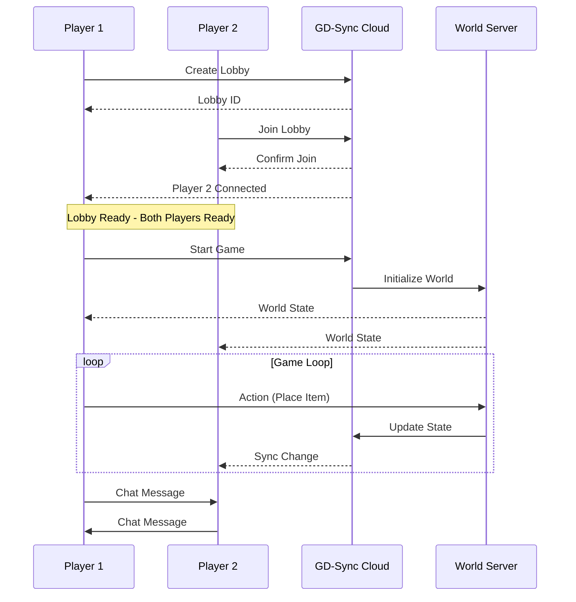

# Roots - Cozy Farming Game Development Plan

## Project Overview

**Title:** Roots  
**Genre:** Cozy Multiplayer Farming Simulation  
**Engine:** Godot 4.7 (Forward Plus, Jolt Physics)  
**Art Style:** Low Poly / Procedural Generation  
**Multiplayer:** Pure Co-op via GD-Sync  
**Target:** Solo Developer, Incremental Development  

**Repository:** [https://github.com/Roanger/Roots.git](https://github.com/Roanger/Roots.git)  
**Contact:** roanger@yahoo.com

---

## Core Vision

Build a peaceful, living world where players can:
- Explore diverse biomes and settle wherever they choose
- Pursue any combination of crafting professions
- Experience meaningful progression through action-based experience
- Build community with other players in pure co-op
- Shape their perfect virtual life

---

## Game Architecture

### Mermaid System Architecture

```mermaid
graph TD
    subgraph Client Layer
        UI[UI System]
        Player[Player Controller]
        Camera[Camera System]
        Inventory[Inventory System]
        Crafting[Crafting System]
        Skills[Skill System]
    end

    subgraph GD-Sync Multiplayer
        Lobby[Lobby System]
        Sync[State Synchronization]
        Chat[Chat System]
    end

    subgraph World Layer
        Chunk[Chunk Manager]
        Biome[Biome System]
        Entities[Entity System]
        Weather[Weather System]
        DayNight[Day/Night Cycle]
    end

    subgraph Data Layer
        Save[Save/Load System]
        Config[Configuration]
        Database[Cloud Database - GD-Sync]
    end

    UI --> Player
    Player --> Camera
    Player --> Inventory
    Player --> Crafting
    Player --> Skills

    Lobby --> Sync
    Sync --> World Layer
    Chat --> Lobby

    World Layer --> Chunk
    Chunk --> Biome
    Chunk --> Entities

    World Layer --> Save
    Save --> Database
```

---

## Development Phases

### Phase 1: Foundation (Weeks 1-8)
**Goal:** Core player movement and basic world

#### 1.1 Project Setup
- [ ] Configure Godot project settings for optimal performance
- [x] Set up version control (git ignore, branching strategy)
- [x] Create project folder structure
- [x] Document coding standards and conventions

#### 1.2 Core Player Controller
- [x] Implement 3D character movement with controller/keyboard
- [x] Add jump, crouch, and interact systems
- [x] Create player states (idle, walk, run, interact)
- [x] Add basic animation state machine
- [x] Implement collision detection with Jolt Physics

#### 1.3 Camera System
- [ ] Create third-person camera with orbit controls *(removed for now; first-person only)*
- [ ] Add camera smoothing and zoom functionality
- [x] Implement first-person toggle
- [ ] Add collision-based camera clipping

#### 1.4 Basic World Generation
- [x] Set up terrain system with chunk loading
- [x] Implement procedural heightmap generation
- [x] Create basic grass and ground textures
- [x] Add simple water plane
- [x] Implement fog and skybox
- [x] Integrate FBX trees and rocks with scale/rotation variation
- [x] Biome-based props (e.g. dead trees in Plains/Mountains/Snow)
- [x] Solid terrain rendering (vertex-colored ground, single-sided shader)
- [x] KayKit Forest Nature Pack: 3D grass and bushes

#### 1.5 Basic UI Framework
- [x] Create main menu with single/multiplayer options
- [x] Implement pause menu
- [x] Set up HUD (health bar, stamina, mini-map)
- [x] Create inventory slot system

#### 1.6 GD-Sync Integration
- [x] Set up GD-Sync configuration
- [ ] Implement basic lobby creation/joining
- [ ] Test local multiplayer connection
- [ ] Configure cloud settings

---

### Phase 2: Core Mechanics (Weeks 9-16)
**Goal:** Farming, crafting, and skill systems

#### 2.1 Inventory System
- [x] Design item database structure
- [x] Implement grid-based inventory UI
- [ ] Create drag-and-drop functionality (inventory ↔ inventory, inventory ↔ hotbar, inventory ↔ equipment)
- [x] Add item stacking and splitting
- [x] Implement hotbar system (8 separate slots; drag from inventory to hotbar/character UI)

#### 2.2 Item System
- [x] Create base Item class
- [x] Define item types (materials, tools, food, seeds, etc.)
- [x] Implement item durability system
- [x] Add item quality/rarity system
- [ ] Create tool tier system

#### 2.3 Farming Core
- [x] Design farm plot tiles
- [x] Implement planting system (seeds → crops)
- [x] Create growth stages and timing
- [x] Add watering system
- [x] Implement harvest mechanics
- [x] Create crop drops and seed recovery

#### 2.4 Tool System
- [x] Design tool types (hoe, watering can, sickle, axe, pickaxe)
- [ ] Implement tool swing/use animations
- [x] Create tool effectiveness calculations (basic - tool_power exists)
- [x] Add tool durability and repair
- [ ] Implement tool progression tiers

#### 2.5 Skill System Architecture
- [ ] Design skill tree structure
- [ ] Create experience gain system
- [ ] Implement skill point allocation
- [ ] Add skill modifier application
- [ ] Design perk system for bonuses

#### 2.6 Basic Crafting
- [ ] Implement crafting menu UI
- [ ] Create recipe database
- [ ] Add ingredient verification
- [ ] Implement crafting process (time, inputs, outputs)
- [ ] Create basic recipes (planks, fences, simple tools)

---

### Phase 3: Professions & Content (Weeks 17-28)
**Goal:** Expand professions and world content

#### 3.1 Profession System Expansion
- [ ] Design profession structure (Blacksmithing, Cooking, Baking, Militia, Husbandry, Alchemy, Herb Gathering)
- [ ] Create profession-specific skill trees
- [ ] Implement profession tools and equipment
- [ ] Add profession-specific interactions
- [ ] Design profession progression rewards

#### 3.2 Herb Gathering & Alchemy
- [ ] Implement wild plant spawning
- [ ] Create identification system
- [ ] Design alchemy recipes
- [ ] Implement potion brewing mechanics
- [ ] Add potion effects system

#### 3.3 Cooking & Baking
- [ ] Create cooking station (fire, stove)
- [ ] Implement recipe cookbook
- [ ] Design food hunger restoration
- [ ] Add cooking speed and quality bonuses
- [ ] Create meal buffs and effects

#### 3.4 Blacksmithing
- [ ] Implement forge and anvil stations
- [ ] Create ore spawning and mining
- [ ] Design smelting process
- [ ] Implement smithing recipes
- [ ] Create weapon/armor crafting

#### 3.5 Husbandry & Animals
- [ ] Design animal AI behaviors
- [ ] Implement animal feeding and care
- [ ] Create breeding system
- [ ] Add animal products (milk, eggs, wool, honey)
- [ ] Design animal housing and pastures

#### 3.6 Militia/Combat
- [ ] Design combat system (if desired)
- [ ] Create weapon types
- [ ] Implement enemy AI
- [ ] Add combat skill progression
- [ ] Design defensive structures

---

### Phase 4: World & Exploration (Weeks 29-40)
**Goal:** Living world with multiple biomes

#### 4.1 Biome System
- [ ] Design biome types (plains, forest, desert, mountain, swamp, coastal)
- [ ] Implement biome-specific terrain generation
- [ ] Create biome transitions
- [ ] Design biome-specific resources
- [ ] Add biome climate effects

#### 4.2 NPC System
- [ ] Design NPC structure and behaviors
- [ ] Create villager AI
- [ ] Implement NPC schedules
- [ ] Design merchant system
- [ ] Add quest givers
- [ ] Implement reputation system

#### 4.3 Settlement System
- [ ] Design plot claiming
- [ ] Implement housing placement
- [ ] Create decoration system
- [ ] Design community buildings
- [ ] Add player-specific land permissions

#### 4.4 Wildlife System
- [ ] Design animal spawn tables per biome
- [ ] Implement animal behaviors (grazing, fleeing, hunting)
- [ ] Create fish spawning and fishing
- [ ] Add wildlife interactions
- [ ] Design seasonal animal migrations

#### 4.5 Environmental Systems
- [ ] Implement weather system (rain, sun, storms, snow)
- [ ] Create day/night cycle
- [ ] Design seasonal effects
- [ ] Add environmental hazards
- [ ] Implement natural disasters

---

### Phase 5: Multiplayer Depth (Weeks 41-52)
**Goal:** Rich co-op experience

#### 5.1 Advanced GD-Sync Features
- [ ] Implement persistent world state
- [ ] Create player-to-player trading
- [ ] Design shared community spaces
- [ ] Implement player messaging
- [ ] Add friend system

#### 5.2 Social Systems
- [ ] Design player emotes
- [ ] Implement player nicknames
- [ ] Create guild/clan system
- [ ] Design shared farm plots
- [ ] Add cooperative building

#### 5.3 World Events
- [ ] Design seasonal festivals
- [ ] Implement community goals
- [ ] Create special events
- [ ] Design limited-time content
- [ ] Add multiplayer minigames

#### 5.4 Server Optimization
- [ ] Optimize chunk loading
- [ ] Implement player interpolation
- [ ] Add prediction and reconciliation
- [ ] Design server-side validation
- [ ] Optimize for scalability

---

### Phase 6: Polish & Content (Ongoing)
**Goal:** Complete the experience

#### 6.1 Art Enhancement
- [ ] Create low-poly character models
- [ ] Design building pieces
- [ ] Create vehicle models
- [ ] Design UI icons and graphics
- [ ] Add particle effects

#### 6.2 Audio Design
- [ ] Create ambient soundscapes
- [ ] Design UI sounds
- [ ] Add music system
- [ ] Implement voice chat
- [ ] Design environmental audio

#### 6.3 Quality of Life
- [ ] Implement quality of life features
- [ ] Add user-friendly tutorials
- [ ] Create accessibility options
- [ ] Design settings menu
- [ ] Add save/load management

#### 6.4 Endgame Content
- [ ] Design long-term goals
- [ ] Create mastery challenges
- [ ] Implement cosmetic unlocks
- [ ] Design achievement system
- [ ] Add story elements

---

## Profession Skills System

### Skill Categories

```mermaid
graph TD
    subgraph Core Skills
        Farming[Cultivation]
        Gathering[Resource Gathering]
        Crafting[Crafting Arts]
    end

    subgraph Professions
        Blacksmith[Blacksmithing]
        Cooking[Cooking]
        Baking[Baking]
        Husbandry[Husbandry]
        Alchemy[Alchemy]
        Militia[Militia]
        Herb[Herb Gathering]
    end

    Farming --> Crop[Crop Farming]
    Farming --> Orchard[Orcharding]
    Gathering --> Foraging[Foraging]
    Gathering --> Mining[Mining]
    Gathering --> Lumber[Lumberjack]

    Blacksmith --> Forge[Forge Work]
    Blacksmith --> Weaponsmith[Weaponsmith]
    Cooking --> Fire[Open Fire]
    Cooking --> Stove[Wood Stove]
    Baking --> Bread[Bread Making]
    Baking --> Pastry[Pastry]
    Husbandry --> Animals[Animal Care]
    Husbandry => Apiary[Apiary]
    Alchemy => Potion[Potions]
    Alchemy => Extract[Extracts]
    Militia => Combat[Combat]
    Militia => Defense[Defense]
```

### Experience Gain Examples

| Action | Base XP | Skill Category |
|--------|---------|----------------|
| Pick mushroom | 2 | Herb Gathering |
| Harvest wheat | 5 | Cultivation |
| Mine iron ore | 8 | Mining |
| Cook soup | 10 | Cooking |
| Bake bread | 12 | Baking |
| Smelt iron | 15 | Blacksmithing |
| Milk cow | 3 | Husbandry |
| Brew potion | 20 | Alchemy |
| Defeat enemy | 25 | Militia |
| Plant seed | 2 | Cultivation |

### Perk System

**Single Discipline Bonus:**
- Mastery (level 50+): +20% efficiency in that profession

**Dual Discipline Synergy:**
- Farmer + Alchemist: +10% herb yield
- Blacksmith + Militia: +10% weapon damage
- Cook + Baker: +15% food hunger restoration

**Triple Discipline Bonus:**
- Farmer + Husbandry + Cooking: Can cook animal products directly (+25% efficiency)

---

## Multiplayer Architecture

### Mermaid Multiplayer Flow



### Multiplayer Features

**Synchronized Systems:**
- Player position and animation
- World state (placed objects, crops, buildings)
- Inventory changes
- Skill progression
- Time of day

**Shared Systems:**
- Community buildings
- Global events
- Shared chat
- Trading
- Friends list

**Private Systems:**
- Personal inventory
- Private land claims
- Individual skill trees
- Personal housing

---

## Biome Design

### Initial Biomes (Priority Order)

| Biome | Resources | Animals | Climate | Difficulty |
|-------|-----------|---------|---------|------------|
| **Meadow Plains** | Wheat, Carrots, Flowers | Sheep, Cows | Temperate | Easy |
| **Sunny Forest** | Berries, Nuts, Wood | Deer, Rabbits | Mild | Easy |
| **Misty Wetlands** | Reeds, Herbs, Clay | Frogs, Ducks | Humid | Medium |
| **Rocky Highlands** | Ores, Stone, Coal | Goats, Bears | Variable | Medium |
| **Arid Desert** | Cacti, Sand, Dates | Scorpions, Camels | Hot | Hard |
| **Frozen Tundra** | Ice, Snow, Pine | Polar Foxes, Penguins | Cold | Hard |

---

## Technical Implementation Notes

### Performance Considerations
- Use Jolt Physics for better performance
- Implement object pooling for frequently spawned items
- Use Level of Detail (LOD) for distant terrain
- Implement chunk culling for unrendered areas
- Use instancing for repeated objects (trees, rocks)

### Save System
- **Local Saves:** Player progress, inventory, skills
- **Cloud Saves:** GD-Sync persistent data
- **World Saves:** Server-side world state
- **Auto-save:** Every 5 minutes
- **Manual save:** Player-triggered

### Modularity
- Design each profession as a self-contained module
- Use dependency injection for systems
- Implement interfaces for easy testing
- Create plugin architecture for future expansion

---

## Development Milestones

### Milestone 1: "First Steps" (Week 8)
- Player can move and explore
- Basic terrain generation
- Simple inventory system
- Single-player functional

### Milestone 2: "Growing Season" (Week 16)
- Farming system complete
- Basic crafting implemented
- First profession functional
- Save/load system working

### Milestone 3: "Village Life" (Week 28)
- All professions implemented
- Animals and husbandry
- Multiple biomes
- NPCs and merchants

### Milestone 4: "Friendship" (Week 40)
- Full multiplayer via GD-Sync
- Settlement and housing
- Weather and seasons
- Rich world events

### Milestone 5: "Home Sweet Home" (Week 52+)
- Complete art assets
- Polish and optimization
- Beta testing
- Early access launch

---

## Recommended Learning Path

For solo development, prioritize these skills:

1. **Week 1-4:** Godot 4.x fundamentals, GDScript mastery
2. **Week 5-8:** Procedural generation techniques, noise functions
3. **Week 9-12:** UI/UX design, inventory systems
4. **Week 13-16:** State machines, behavior trees
5. **Week 17-20:** GD-Sync multiplayer implementation
6. **Week 21-28:** Advanced AI, pathfinding
7. **Week 29+:** Optimization, profiling, polish

---

## Next Steps

1. ~~Review and approve this plan~~ ✓
2. ~~Phase 1.4: Basic World Generation (terrain, assets)~~ ✓
3. ~~Phase 2.1: Drag-and-drop (inventory, hotbar, equipment)~~ ✓
4. Phase 2.2–2.6: Item tiers, tool animations, crafting menu, skill architecture
5. Phase 3+: Professions, content, world expansion

---

*Plan created for: Roots - Cozy Farming Game*  
*Engine: Godot 4.7 | Multiplayer: GD-Sync | Art: Low Poly Procedural*  
*Last updated: Jan 2026 – Phase 2.1 drag-and-drop complete; world assets and terrain improvements in place.*
