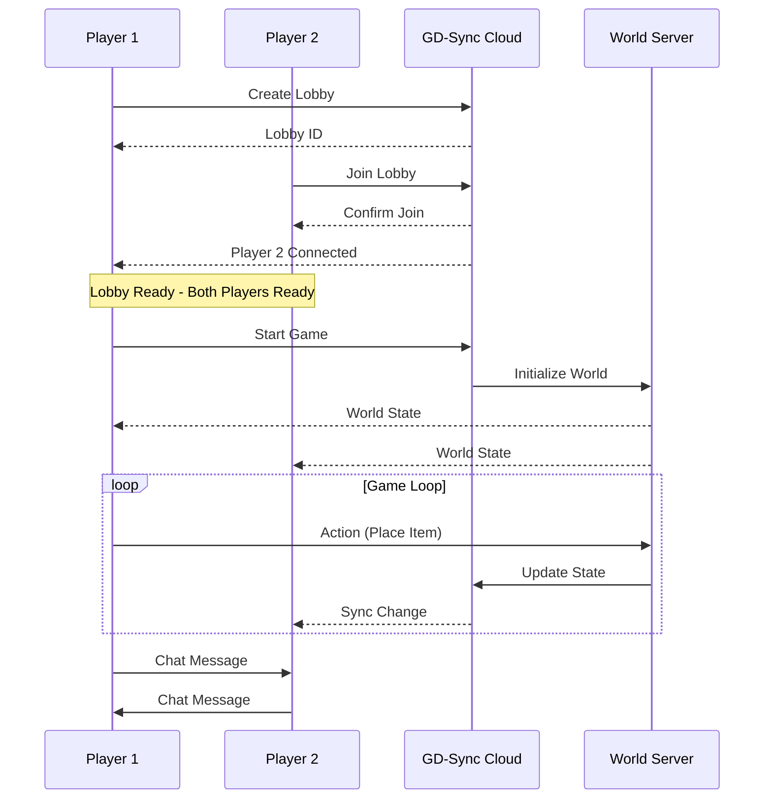

# Roots - Cozy Farming Game Development Plan

## Project Overview

**Title:** Roots  
**Genre:** Cozy Multiplayer Farming Simulation  
**Engine:** Godot 4.7 (Forward Plus, Jolt Physics)  
**Art Style:** Low Poly / Procedural Generation  
**Multiplayer:** Pure Co-op via GD-Sync  
**Target:** Solo Developer, Incremental Development  

**Repository:** [https://github.com/Roanger/Roots.git](https://github.com/Roanger/Roots.git)  
**Contact:** roanger@yahoo.com

---

## Core Vision

Build a peaceful, living world where players can:
- Explore diverse biomes and settle wherever they choose
- Pursue any combination of crafting professions
- Experience meaningful progression through action-based experience
- Build community with other players in pure co-op
- Shape their perfect virtual life

---

## Game Architecture

### Mermaid System Architecture

```mermaid
graph TD
    subgraph Client Layer
        UI[UI System]
        Player[Player Controller]
        Camera[Camera System]
        Inventory[Inventory System]
        Crafting[Crafting System]
        Skills[Skill System]
    end

    subgraph GD-Sync Multiplayer
        Lobby[Lobby System]
        Sync[State Synchronization]
        Chat[Chat System]
    end

    subgraph World Layer
        Chunk[Chunk Manager]
        Biome[Biome System]
        Entities[Entity System]
        Weather[Weather System]
        DayNight[Day/Night Cycle]
    end

    subgraph Data Layer
        Save[Save/Load System]
        Config[Configuration]
        Database[Cloud Database - GD-Sync]
    end

    UI --> Player
    Player --> Camera
    Player --> Inventory
    Player --> Crafting
    Player --> Skills

    Lobby --> Sync
    Sync --> World Layer
    Chat --> Lobby

    World Layer --> Chunk
    Chunk --> Biome
    Chunk --> Entities

    World Layer --> Save
    Save --> Database
```

---

## Development Phases

### Phase 1: Foundation (Weeks 1-8)
**Goal:** Core player movement and basic world

#### 1.1 Project Setup
- [ ] Configure Godot project settings for optimal performance
- [x] Set up version control (git ignore, branching strategy)
- [x] Create project folder structure
- [x] Document coding standards and conventions

#### 1.2 Core Player Controller
- [x] Implement 3D character movement with controller/keyboard
- [x] Add jump, crouch, and interact systems
- [x] Create player states (idle, walk, run, interact)
- [x] Add basic animation state machine
- [x] Implement collision detection with Jolt Physics

#### 1.3 Camera System
- [ ] Create third-person camera with orbit controls *(removed for now; first-person only)*
- [ ] Add camera smoothing and zoom functionality
- [x] Implement first-person toggle
- [ ] Add collision-based camera clipping

#### 1.4 Basic World Generation
- [x] Set up terrain system with chunk loading
- [x] Implement procedural heightmap generation
- [x] Create basic grass and ground textures
- [x] Add simple water plane
- [x] Implement fog and skybox (BinbunSky shader: procedural clouds, sun disc, stars, day/night auto-blend)
- [x] Integrate FBX trees and rocks with scale/rotation variation
- [x] Biome-based props (e.g. dead trees in Plains/Mountains/Snow)
- [x] KayKit Forest Nature Pack: 3D grass and bushes
- [x] **[REWRITE]** Transition from Voxel Terrain to Smooth Heightmap Terrain (better AI nav, building placement, cozy aesthetic) — *Complete Feb 2026. See terrain_rewrite_plan.md*

#### 1.5 Basic UI Framework
- [x] Create main menu with single/multiplayer options
- [x] Implement pause menu
- [x] Set up HUD (health bar, stamina, mini-map)
- [x] Create inventory slot system

#### 1.6 GD-Sync Integration
- [x] Set up GD-Sync configuration
- [ ] Implement basic lobby creation/joining
- [ ] Test local multiplayer connection
- [ ] Configure cloud settings

---

### Phase 2: Core Mechanics (Weeks 9-16)
**Goal:** Farming, crafting, and skill systems

#### 2.1 Inventory System
- [x] Design item database structure
- [x] Implement grid-based inventory UI
- [x] Create drag-and-drop functionality (inventory ↔ inventory, inventory ↔ hotbar, inventory ↔ equipment)
  - **Note:** Uses custom drag detection with `force_drag()` and `NOTIFICATION_DRAG_END` workaround for Godot 4.7
  - Uses Engine meta for shared state to prevent duplicate drop processing
- [x] Add item stacking and splitting
- [x] Implement hotbar system (8 separate slots; drag from inventory to hotbar/character UI)
- [x] Equipment system with persistence (items persist when UI is closed/reopened)

#### 2.2 Item System
- [x] Create base Item class
- [x] Define item types (materials, tools, food, seeds, etc.)
- [x] Implement item durability system
- [x] Add item quality/rarity system
- [x] 3D tool/weapon models (KayKit RPGToolsBits + Adventurers packs)
- [x] First-person tool holder with walking bob animation
- [x] Create tool tier system (Wood → Bronze → Iron → Steel → Mythril)

#### 2.3 Farming Core
- [x] Design farm plot tiles
- [x] Implement planting system (seeds → crops)
- [x] Create growth stages and timing
- [x] Add watering system
- [x] Implement harvest mechanics
- [x] Create crop drops and seed recovery

#### 2.4 Tool System
- [x] Design tool types (hoe, watering can, sickle, axe, pickaxe, hammer, saw, chisel)
- [x] Implement tool swing/use animations (swing on farm plot interaction)
- [x] Create tool effectiveness calculations (basic - tool_power exists)
- [x] Add tool durability and repair
- [x] 3D weapon items (sword, battle axe, dagger) with icons and models
- [x] Left-click swing for general tool/weapon use (trees, rocks, combat)
- [x] Tool affinity system (tool_affinity.gd - effectiveness multipliers per tool/target type)
- [x] Implement tool progression tiers (5 tiers with scaling power/durability/affinity multipliers)

#### 2.5 Skill System Architecture
- [x] Design skill tree structure
- [x] Create experience gain system (SkillManager autoload singleton)
- [x] Implement skill point allocation
- [x] Add skill modifier application
- [x] Design perk system for bonuses (synergy perks for dual/triple disciplines)
- [x] Skill Tree UI (K key toggle, category grouping, XP bars)
- [x] Skill data serialization in save system
- [x] XP wired to farming actions (till, water, plant, harvest)

#### 2.6 Basic Crafting
- [x] Implement crafting menu UI (R key toggle, category tabs, ingredient display)
- [x] Create recipe database (RecipeDatabase autoload singleton)
- [x] Add ingredient verification (has_ingredients / consume_ingredients)
- [x] Implement crafting process (time, progress bar, inputs, outputs)
- [x] Create basic recipes (planks, fences, tools, ingots, tiered tools)
- [x] Register 22+ crafting materials (wood, stone, ores, fiber, cloth, etc.)
- [x] 40+ recipes across all tiers and categories

---

### Phase 3: Professions & Content (Weeks 17-28)
**Goal:** Expand professions and world content

#### 3.1 Profession System Expansion
- [x] Design profession structure (Blacksmithing, Cooking, Baking, Militia, Husbandry, Alchemy, Herb Gathering)
- [x] Create profession-specific skill trees (PerkData resource, 5-tier perk chains per profession, unlock with skill points)
- [ ] Implement profession tools and equipment
- [ ] Add profession-specific interactions
- [x] Design profession progression rewards (XP bonus, yield bonus, damage/defense, resource saving, buff duration, double harvest, crit chance perks)

#### 3.2 Herb Gathering & Alchemy
- [x] Implement wild plant spawning (mushrooms, flowers, ferns, clovers are harvestable biome decorations with loot tables)
- [x] Add HERB target type to ToolAffinity (sickle/knife harvest herbs)
- [x] Register herb items (common_mushroom, golden_mushroom, lavender, chamomile, mint_leaf, sage_leaf, nightshade, wild_clover, fern_frond)
- [x] Design alchemy recipes (6 potions at Alchemy Table: health, greater health, stamina, speed, strength, antidote)
- [x] Implement potion brewing mechanics (Alchemy Table crafting station, empty bottle recipe)
- [x] Add potion effects system (buff system: heal-over-time, stamina regen, speed boost, strength boost, antidote)
- [x] Herb gathering XP (HarvestableResource grants pick_mushroom/forage_item XP on harvest)
- [ ] Create identification system (discovering new plants)

#### 3.3 Cooking & Baking
- [x] Create cooking station (Cooking Fire, station_type=4, spawned near player)
- [x] Implement 14 cooking recipes (flour, butter, cheese, cooked meats, soups, stews, pies, tea)
- [x] Design food as buffs (no hunger bar — cozy approach: food heals + grants timed buffs)
- [x] Add well_fed buff (multiplies healing/stamina restore while active)
- [x] Create meal buffs and effects (well_fed, speed, strength, heal-over-time, stamina regen)
- [x] Cooking XP on food consumption (cook_food action → 10 XP)
- [x] New items: flour, butter, cheese, apple, cooked_meat, cooked_venison, cooked_rabbit, fried_egg, vegetable_soup, mushroom_soup, hearty_stew, meat_pie, apple_pie, mushroom_tea

#### 3.4 Blacksmithing
- [x] Implement forge and anvil stations (CraftingStationObject world objects)
- [x] Create ore spawning and mining (rocks drop stone/coal/iron/copper via HarvestableResource)
- [x] Design smelting process (forge recipes: ore→ingot, steel alloy, mythril)
- [x] Implement smithing recipes (40+ recipes across all tiers)
- [ ] Create weapon/armor crafting (tiered weapons, armor sets)

#### 3.5 Husbandry & Animals
- [x] Design animal AI behaviors (BaseAnimal: idle/wander/flee/follow/feeding/hurt/dead states)
- [x] Create AnimalData resource (species, products, feed, timers, collision, model)
- [x] Implement 8 animal species: Chicken, Cow, Sheep, Goat, Duck, Boar, Deer, Rabbit
- [x] Add animal product items (egg, milk, wool, raw_meat, feathers, venison, rabbit_meat, rabbit_fur, deer_pelt, animal_feed)
- [x] Wire QiwiiPack 3D models (Chicken, Cow, Sheep White, Pig, Chick) with FBX offset/rotation fixes
- [x] Animals produce items on timers (eggs, milk, wool) and drop loot on death
- [x] Terrain snapping and smooth wander/flee movement
- [x] Fence/gate placement system (PLACEABLE item type, ghost preview, Q to rotate, left-click to place)
- [x] PlaceableObject world script (collision blocks animals, gates open/close, hammer to pick up)
- [x] Fence crafting recipes at Workbench (fence=2 planks+string, post=1 log, gate=3 planks+2 string+iron)
- [x] Modular terrain collection integrated (Hilly_Prop_Fence OBJ models for fences/gates/posts)
- [x] Implement animal feeding and care (E-key: hold food → feed, empty hand → pet, floating text feedback)
- [x] Create breeding system (feed two same-species adults near each other → baby spawns, breed cooldown)
- [x] Add more building placeables (Barn, Hut, Feeding Trough, Campfire, Sitting Log + crafting recipes)
- [x] FBX offset fix in PlaceableObject for QiwiiPack building models
- [ ] Find/add models for goat, deer, rabbit (currently placeholder capsules)

#### 3.6 Militia/Combat
- [x] Design combat system (left-click swing, tool affinity damage, tier scaling)
- [x] Create weapon types (sword, battle_axe, dagger with affinity vs ENEMY)
- [x] Implement enemy AI (BaseEnemy: idle/wander/chase/attack/hurt/dead states)
- [x] Player damage + death/respawn system
- [x] Enemy loot drops (WorldItem auto-pickup)
- [x] Enemy types: Skeleton Minion, Skeleton Rogue, Skeleton Warrior, Skeleton Mage (KayKit 3D models)
- [ ] Add combat skill progression (XP wiring exists, needs balancing)
- [ ] Design defensive structures

---

### Phase 4: World & Exploration (Weeks 29-40)
**Goal:** Living world with multiple biomes

#### 4.1 Biome System
- [x] Design biome types (plains, forest, desert, mountain, swamp, coastal)
- [x] Implement biome-specific terrain generation
- [x] Create biome transitions
- [ ] Design biome-specific resources
- [ ] Add biome climate effects

#### 4.2 NPC System
- [x] Design NPC structure and behaviors (NPCData resource: role, identity, model, dialogue tree, shop inventory, quest refs)
- [x] Create villager AI (BaseNPC: IDLE/WANDER/TALKING states, terrain snapping, on_interact → dialogue)
- [ ] Implement NPC schedules
- [x] Design merchant system (ShopUI: item list with buy buttons, gold_coin currency, stock management)
- [x] Add quest givers (NPC quest glow system, dialogue-driven quest accept/turnin)
- [ ] Implement reputation system
- [x] 8 village NPCs: Elara (Shopkeeper), Bram (Innkeeper), Tormund (Blacksmith), Marta (Baker), Aldric (Mayor/Quest Giver), Sage Willow (Herbalist), Old Hank (Farmer), Captain Rolf (Guard)
- [x] DialogueUI (bottom panel: NPC name, rich text, choice buttons, actions: shop/close/quest/next)
- [x] KayKit Adventurers 3D models (Barbarian, Knight, Mage, Ranger, Rogue, Rogue_Hooded)
- [x] NPC quest glow (yellow glow when NPC has available/turnable quests or active TALK_TO_NPC objectives)
- [x] Town Builder system (Medieval Village MegaKit modular buildings for village layout)

#### 4.3 Settlement System
- [x] **[REWRITE]** Terrain modification system (hoe tills ground → dark soil + FarmPlot spawn, shovel flattens/digs)
- [x] **[REWRITE]** TileMod types tracking (TILLED, DUG, PATH, FOUNDATION)
- [x] **[REWRITE]** Dynamic FarmPlot spawning on tilled terrain
- [x] **[REWRITE]** Terrain visual feedback (vertex color changes for modified cells)
- [x] **[REWRITE]** Save/load terrain modifications per chunk
- [~] Shovel digging visuals — *In Progress: bowl depression works, further polish needed*
- [ ] Design plot claiming
- [ ] Implement housing placement
- [ ] Create decoration system
- [ ] Design community buildings
- [ ] Add player-specific land permissions

#### 4.6 Quest System
- [x] QuestData resource (status, objectives, rewards, prerequisites, NPC giver/turnin, quest chains)
- [x] QuestManager autoload (accept, track progress, complete, turn in, prerequisite gating)
- [x] QuestDatabase with 10+ quests across 3 chains (gather_supplies, first_harvest, skeleton_threat)
- [x] Objective types: COLLECT_ITEM, DEFEAT_ENEMY, TALK_TO_NPC, CRAFT_ITEM, HARVEST_CROP, TILL_SOIL
- [x] COLLECT_ITEM tracking via inventory polling (connected to inventory_changed/hotbar_changed signals)
- [x] Quest Journal UI (J key toggle, full-screen panel with Active/Available/Completed tabs)
- [x] Quest detail pane (description, objectives with progress, rewards, NPC info)
- [x] Click-to-track system (up to 4 tracked quests shown on HUD quest tracker)
- [x] Auto-track on quest accept, auto-untrack on quest turn in
- [x] Quest flow gating: only "welcome" quest available at start, others unlock after welcome is turned in
- [x] HUD Quest Tracker UI (top-right, shows tracked quest names + objective progress)
- [x] NPC dialogue-driven quest accept and turn-in with reward granting
- [ ] Quest notification popups (quest accepted, quest complete, quest turned in)
- [ ] Quest compass/waypoint markers
- [ ] More quest content and chains

#### 4.4 Wildlife System
- [ ] Design animal spawn tables per biome
- [ ] Implement animal behaviors (grazing, fleeing, hunting)
- [ ] Create fish spawning and fishing
- [ ] Add wildlife interactions
- [ ] Design seasonal animal migrations

#### 4.5 Environmental Systems
- [ ] Implement weather system (rain, sun, storms, snow)
- [x] Create day/night cycle (sun rotation, light energy/color transitions, ambient/fog darkening)
- [x] BinbunSky shader integration (procedural clouds, sun disc, stars, automatic day/night/sunset via LIGHT0_DIRECTION)
- [x] In-game clock UI below minimap (time, day of week, season, sun/moon icon)
- [x] Design seasonal effects (cloud density/color + fog density per season: Summer clear → Winter overcast)
- [ ] Add environmental hazards
- [ ] Implement natural disasters

---

### Phase 5: Multiplayer Depth (Weeks 41-52)
**Goal:** Rich co-op experience

#### 5.1 Advanced GD-Sync Features
- [ ] Implement persistent world state
- [ ] Create player-to-player trading
- [ ] Design shared community spaces
- [ ] Implement player messaging
- [ ] Add friend system

#### 5.2 Social Systems
- [ ] Design player emotes
- [ ] Implement player nicknames
- [ ] Create guild/clan system
- [ ] Design shared farm plots
- [ ] Add cooperative building

#### 5.3 World Events
- [ ] Design seasonal festivals
- [ ] Implement community goals
- [ ] Create special events
- [ ] Design limited-time content
- [ ] Add multiplayer minigames

#### 5.4 Server Optimization
- [ ] Optimize chunk loading
- [ ] Implement player interpolation
- [ ] Add prediction and reconciliation
- [ ] Design server-side validation
- [ ] Optimize for scalability

---

### Phase 6: Polish & Content (Ongoing)
**Goal:** Complete the experience

#### 6.1 Art Enhancement
- [ ] Create low-poly character models
- [ ] Design building pieces
- [ ] Create vehicle models
- [ ] Design UI icons and graphics
- [ ] Add particle effects

#### 6.2 Audio Design
- [ ] Create ambient soundscapes
- [ ] Design UI sounds
- [ ] Add music system
- [ ] Implement voice chat
- [ ] Design environmental audio

#### 6.3 Quality of Life
- [ ] Implement quality of life features
- [ ] Add user-friendly tutorials
- [ ] Create accessibility options
- [ ] Design settings menu
- [ ] Add save/load management

#### 6.4 Endgame Content
- [ ] Design long-term goals
- [ ] Create mastery challenges
- [ ] Implement cosmetic unlocks
- [ ] Design achievement system
- [ ] Add story elements

---

## Profession Skills System

### Skill Categories

```mermaid
graph TD
    subgraph Core Skills
        Farming[Cultivation]
        Gathering[Resource Gathering]
        Crafting[Crafting Arts]
    end

    subgraph Professions
        Blacksmith[Blacksmithing]
        Cooking[Cooking]
        Baking[Baking]
        Husbandry[Husbandry]
        Alchemy[Alchemy]
        Militia[Militia]
        Herb[Herb Gathering]
    end

    Farming --> Crop[Crop Farming]
    Farming --> Orchard[Orcharding]
    Gathering --> Foraging[Foraging]
    Gathering --> Mining[Mining]
    Gathering --> Lumber[Lumberjack]

    Blacksmith --> Forge[Forge Work]
    Blacksmith --> Weaponsmith[Weaponsmith]
    Cooking --> Fire[Open Fire]
    Cooking --> Stove[Wood Stove]
    Baking --> Bread[Bread Making]
    Baking --> Pastry[Pastry]
    Husbandry --> Animals[Animal Care]
    Husbandry => Apiary[Apiary]
    Alchemy => Potion[Potions]
    Alchemy => Extract[Extracts]
    Militia => Combat[Combat]
    Militia => Defense[Defense]
```

### Experience Gain Examples

| Action | Base XP | Skill Category |
|--------|---------|----------------|
| Pick mushroom | 2 | Herb Gathering |
| Harvest wheat | 5 | Cultivation |
| Mine iron ore | 8 | Mining |
| Cook soup | 10 | Cooking |
| Bake bread | 12 | Baking |
| Smelt iron | 15 | Blacksmithing |
| Milk cow | 3 | Husbandry |
| Brew potion | 20 | Alchemy |
| Defeat enemy | 25 | Militia |
| Plant seed | 2 | Cultivation |

### Perk System

**Single Discipline Bonus:**
- Mastery (level 50+): +20% efficiency in that profession

**Dual Discipline Synergy:**
- Farmer + Alchemist: +10% herb yield
- Blacksmith + Militia: +10% weapon damage
- Cook + Baker: +15% food hunger restoration

**Triple Discipline Bonus:**
- Farmer + Husbandry + Cooking: Can cook animal products directly (+25% efficiency)

---

## Multiplayer Architecture

### Mermaid Multiplayer Flow

```mermaid
sequenceDiagram
    participant P1 as Player 1
    participant P2 as Player 2
    participant GD as GD-Sync Cloud
    participant World as World Server

    P1->>GD: Create Lobby
    GD-->>P1: Lobby ID
    P2->>GD: Join Lobby
    GD-->>P2: Confirm Join
    GD-->>P1: Player 2 Connected

    Note over P1, P2: Lobby Ready - Both Players Ready

    P1->>GD: Start Game
    GD->>World: Initialize World
    World-->>P1: World State
    World-->>P2: World State

    loop Game Loop
        P1->>World: Action (Place Item)
        World->>GD: Update State
        GD-->>P2: Sync Change
    end

    P1->>P2: Chat Message
    P2->>P1: Chat Message
```

### Multiplayer Features

**Synchronized Systems:**
- Player position and animation
- World state (placed objects, crops, buildings)
- Inventory changes
- Skill progression
- Time of day

**Shared Systems:**
- Community buildings
- Global events
- Shared chat
- Trading
- Friends list

**Private Systems:**
- Personal inventory
- Private land claims
- Individual skill trees
- Personal housing

---

## Biome Design

### Initial Biomes (Priority Order)

| Biome | Resources | Animals | Climate | Difficulty |
|-------|-----------|---------|---------|------------|
| **Meadow Plains** | Wheat, Carrots, Flowers | Sheep, Cows | Temperate | Easy |
| **Sunny Forest** | Berries, Nuts, Wood | Deer, Rabbits | Mild | Easy |
| **Misty Wetlands** | Reeds, Herbs, Clay | Frogs, Ducks | Humid | Medium |
| **Rocky Highlands** | Ores, Stone, Coal | Goats, Bears | Variable | Medium |
| **Arid Desert** | Cacti, Sand, Dates | Scorpions, Camels | Hot | Hard |
| **Frozen Tundra** | Ice, Snow, Pine | Polar Foxes, Penguins | Cold | Hard |

---

## Technical Implementation Notes

### Performance Considerations
- Use Jolt Physics for better performance
- Implement object pooling for frequently spawned items
- Use Level of Detail (LOD) for distant terrain
- Implement chunk culling for unrendered areas
- Use instancing for repeated objects (trees, rocks)

### Smooth Heightmap Terrain Rewrite (Planned Feb 2026)
- **Motivation:** Voxel terrain (while optimized) clashes with the smooth low-poly aesthetic, breaks standard AI NavMesh generation, and makes building placement (farmhouses, large plots) extremely difficult. A cozy game requires predictable, rolling terrain.
- **Architecture:** `ChunkData` will shift from a 3D voxel array (`PackedByteArray`) to a 2D heightmap array (`PackedFloat32Array`).
- **Mesh Generation:** Chunks will generate a standard grid mesh using `ArrayMesh`.
- **Physics:** The terrain will use a standard `StaticBody3D` with a `ConcavePolygonShape3D` or `HeightMapShape3D` (Jolt Physics). This allows players and AI to use standard `CharacterBody3D` physics (`move_and_slide`, `is_on_floor`) instead of manual raycast grounding.
- **Modifications:** Digging will be replaced with localized vertex height adjustments (flattening) or splatmap painting (paths, tilled soil).
- **Caves:** Will be moved to dedicated instanced scenes rather than seamless holes in the overworld.

### Save System
- **Local Saves:** Player progress, inventory, skills
- **Cloud Saves:** GD-Sync persistent data
- **World Saves:** Server-side world state
- **Auto-save:** Every 5 minutes
- **Manual save:** Player-triggered

### Modularity
- Design each profession as a self-contained module
- Use dependency injection for systems
- Implement interfaces for easy testing
- Create plugin architecture for future expansion

---

## Development Milestones

### Milestone 1: "First Steps" (Week 8)
- Player can move and explore
- Basic terrain generation
- Simple inventory system
- Single-player functional

### Milestone 2: "Growing Season" (Week 16)
- Farming system complete
- Basic crafting implemented
- First profession functional
- Save/load system working

### Milestone 3: "Village Life" (Week 28)
- All professions implemented
- Animals and husbandry
- Multiple biomes
- NPCs and merchants

### Milestone 4: "Friendship" (Week 40)
- Full multiplayer via GD-Sync
- Settlement and housing
- Weather and seasons
- Rich world events

### Milestone 5: "Home Sweet Home" (Week 52+)
- Complete art assets
- Polish and optimization
- Beta testing
- Early access launch

---

## Recommended Learning Path

For solo development, prioritize these skills:

1. **Week 1-4:** Godot 4.x fundamentals, GDScript mastery
2. **Week 5-8:** Procedural generation techniques, noise functions
3. **Week 9-12:** UI/UX design, inventory systems
4. **Week 13-16:** State machines, behavior trees
5. **Week 17-20:** GD-Sync multiplayer implementation
6. **Week 21-28:** Advanced AI, pathfinding
7. **Week 29+:** Optimization, profiling, polish

---

## Next Steps

1. ~~Review and approve this plan~~ ✓
2. ~~Phase 1.4: Basic World Generation (terrain, assets)~~ ✓
3. ~~Phase 2.1: Drag-and-drop (inventory, hotbar, equipment)~~ ✓
4. ~~Phase 2.5: Skill system architecture~~ ✓
5. ~~Phase 2.4: 3D tool models, swing animations, tool affinity, tool tiers~~ ✓
6. ~~Phase 2.6: Crafting system (menu UI, recipes, 40+ recipes, 5 tool tiers)~~ ✓
7. ~~Phase 3.4: Blacksmithing — Forge/anvil crafting stations, ore mining, smelting~~ ✓
8. ~~Phase 3.6: Militia/Combat — Enemy AI, combat system, loot drops~~ ✓
9. ~~Harvestable world objects — Trees drop wood, rocks drop stone/ore~~ ✓
10. ~~Phase 3.2: Herb Gathering & Alchemy — Harvestable herbs, alchemy table, 6 potions, buff system~~ ✓
11. ~~Phase 4.5: Environmental — Day/night cycle, BinbunSky shader, seasonal sky, clock UI~~ ✓
12. ~~Phase 3.3: Cooking — 14 recipes, food buffs, well_fed system, cooking XP~~ ✓
13. ~~Phase 3.5: Husbandry — Animal feeding/petting, breeding system, building placeables~~ ✓
14. ~~**[REWRITE]** Smooth Heightmap Terrain Transition~~ ✓
    - ~~Strip out Voxel 3D arrays~~ ✓
    - ~~Implement 2D Grid Heightmap generation~~ ✓
    - ~~Add real Physics collision (`ConcavePolygonShape3D`)~~ ✓
    - ~~Update Player/AI to use standard `move_and_slide()` physics~~ ✓
    - ~~Re-integrate farm plot tilling and object placement~~ ✓
    - ~~Fix chunk seam stitching~~ ✓
    - ~~Fix WorldItem collision (not pushed by player)~~ ✓
    - **Shovel digging visuals** — In Progress (bowl shape works, polish needed) ⚠️
15. ~~**Phase 4.2: NPC System** — Villagers, merchants, quests~~ ✓
16. **Next:** Continue digging polish, then Phase 1 remaining (camera, GD-Sync lobby, project settings)

---

*Plan created for: Roots - Cozy Farming Game*  
*Engine: Godot 4.7 | Multiplayer: GD-Sync | Art: Low Poly Procedural*  
*Last updated: Feb 2026 – **Smooth Heightmap Terrain Rewrite complete.** All voxel systems stripped. 2D heightmap generation with `ConcavePolygonShape3D` physics collision. Player, AI (animals, enemies, NPCs), and WorldItems all use standard Godot physics (`move_and_slide`, `RigidBody3D`). Chunk seam stitching implemented (edge vertices sample noise for seamless boundaries). Hoe tilling + FarmPlot spawning re-integrated. Shovel digging functional (3×3 bowl depression + DUG vertex color) but visual polish still in progress. WorldItem loot pickup fixed (not pushed by player). NPC system complete (8 village NPCs, dialogue, shops, quests). Full gameplay loop: explore → farm → cook → breed animals → fight. Next: digging polish, then camera/GD-Sync/project settings.*
