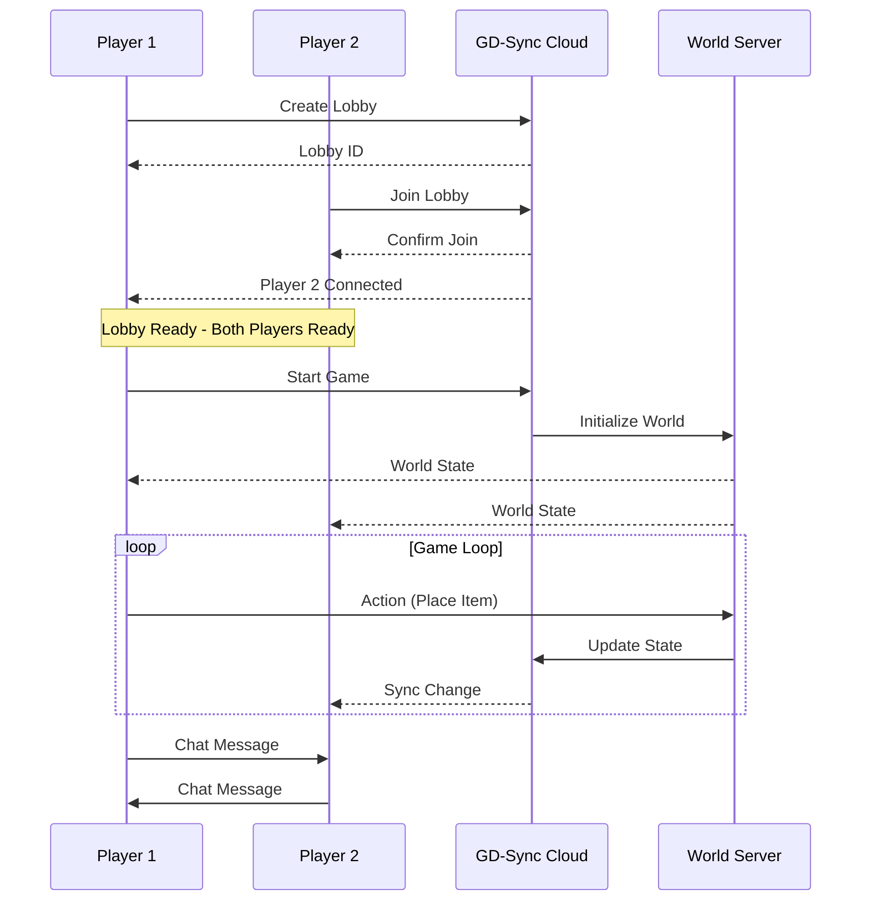

# Roots - Cozy Farming Game Development Plan

## Project Overview

**Title:** Roots  
**Genre:** Cozy Multiplayer Farming Simulation  
**Engine:** Godot 4.7 (Forward Plus, Jolt Physics)  
**Art Style:** Low Poly / Procedural Generation  
**Multiplayer:** Pure Co-op via GD-Sync  
**Target:** Solo Developer, Incremental Development  

**Repository:** [https://github.com/Roanger/Roots.git](https://github.com/Roanger/Roots.git)  
**Contact:** roanger@yahoo.com

---

## Core Vision

Build a peaceful, living world where players can:
- Explore diverse biomes and settle wherever they choose
- Pursue any combination of crafting professions
- Experience meaningful progression through action-based experience
- Build community with other players in pure co-op
- Shape their perfect virtual life

---

## Game Architecture

### Mermaid System Architecture

```mermaid
graph TD
    subgraph Client Layer
        UI[UI System]
        Player[Player Controller]
        Camera[Camera System]
        Inventory[Inventory System]
        Crafting[Crafting System]
        Skills[Skill System]
    end

    subgraph GD-Sync Multiplayer
        Lobby[Lobby System]
        Sync[State Synchronization]
        Chat[Chat System]
    end

    subgraph World Layer
        Chunk[Chunk Manager]
        Biome[Biome System]
        Entities[Entity System]
        Weather[Weather System]
        DayNight[Day/Night Cycle]
    end

    subgraph Data Layer
        Save[Save/Load System]
        Config[Configuration]
        Database[Cloud Database - GD-Sync]
    end

    UI --> Player
    Player --> Camera
    Player --> Inventory
    Player --> Crafting
    Player --> Skills

    Lobby --> Sync
    Sync --> World Layer
    Chat --> Lobby

    World Layer --> Chunk
    Chunk --> Biome
    Chunk --> Entities

    World Layer --> Save
    Save --> Database
```

---

## Development Phases

### Phase 1: Foundation (Weeks 1-8)
**Goal:** Core player movement and basic world

#### 1.1 Project Setup
- [x] Configure Godot project settings for optimal performance
- [x] Set up version control (git ignore, branching strategy)
- [x] Create project folder structure
- [x] Document coding standards and conventions

#### 1.2 Core Player Controller
- [x] Implement 3D character movement with controller/keyboard
- [x] Add jump, crouch, and interact systems
- [x] Create player states (idle, walk, run, interact)
- [x] Add basic animation state machine
- [x] Implement collision detection with Jolt Physics

#### 1.3 Camera System
- [~] Create third-person camera with orbit controls *(removed for now; first-person only)*
- [x] Add camera smoothing and zoom functionality
- [x] Implement first-person toggle *(always first-person; toggle removed)*
- [x] Add collision-based camera clipping *(upward raycast for low ceilings; player body excluded)*

#### 1.4 Basic World Generation
- [x] Set up terrain system with chunk loading
- [x] Implement procedural heightmap generation
- [x] Create basic grass and ground textures
- [x] Add simple water plane
- [x] Implement fog and skybox (procedural clouds, sun disc, stars, day/night auto-blend)
- [x] Integrate FBX trees and rocks with scale/rotation variation
- [x] Biome-based props (e.g. dead trees in Plains/Mountains/Snow)
- [x] **[REWRITE]** Transition from Voxel Terrain to Smooth Heightmap Terrain (better AI nav, building placement, cozy aesthetic) — *Complete Feb 2026. See terrain_rewrite_plan.md*
- [x] **[REWRITE v2]** Transition from Heightmap Terrain to godot_voxel `VoxelLodTerrain` (smooth SDF terrain, native collision, biome shader, real rivers/lakes) — *Complete Jul 2026. Old heightmap `chunk_manager`/`chunk_data` deleted. See terrain_rewrite_plan.md § Terrain v2*
- [x] Loading screen with seed display; all entity spawns gated behind terrain collision readiness (fixes falling through world on load)

#### 1.5 Basic UI Framework
- [x] Create main menu with single/multiplayer options
- [x] Implement pause menu
- [x] Set up HUD (health bar, stamina, mini-map)
- [x] Create inventory slot system

#### 1.6 GD-Sync Integration
- [x] Set up GD-Sync configuration
- [x] Implement basic lobby creation/joining
- [x] Test local multiplayer connection *(single-process verified; two-process requires cloud keys)*
- [ ] Configure cloud settings *(requires gd-sync.com account + API keys)*

---

### Phase 2: Core Mechanics (Weeks 9-16)
**Goal:** Farming, crafting, and skill systems

#### 2.1 Inventory System
- [x] Design item database structure
- [x] Implement grid-based inventory UI
- [x] Create drag-and-drop functionality (inventory ↔ inventory, inventory ↔ hotbar, inventory ↔ equipment)
  - **Note:** Uses custom drag detection with `force_drag()` and `NOTIFICATION_DRAG_END` workaround for Godot 4.7
  - Uses Engine meta for shared state to prevent duplicate drop processing
- [x] Add item stacking and splitting
- [x] Implement hotbar system (8 separate slots; drag from inventory to hotbar/character UI)
- [x] Equipment system with persistence (items persist when UI is closed/reopened)

#### 2.2 Item System
- [x] Create base Item class
- [x] Define item types (materials, tools, food, seeds, etc.)
- [x] Implement item durability system
- [x] Add item quality/rarity system
- [x] 3D tool/weapon models
- [x] First-person tool holder with walking bob animation
- [x] Create tool tier system (Wood → Bronze → Iron → Steel → Mythril)

#### 2.3 Farming Core
- [x] Design farm plot tiles
- [x] Implement planting system (seeds → crops)
- [x] Create growth stages and timing
- [x] Add watering system
- [x] Implement harvest mechanics
- [x] Create crop drops and seed recovery

#### 2.4 Tool System
- [x] Design tool types (hoe, watering can, sickle, axe, pickaxe, hammer, saw, chisel)
- [x] Implement tool swing/use animations (swing on farm plot interaction)
- [x] Create tool effectiveness calculations (basic - tool_power exists)
- [x] Add tool durability and repair
- [x] 3D weapon items (sword, battle axe, dagger) with icons and models
- [x] Left-click swing for general tool/weapon use (trees, rocks, combat)
- [x] Tool affinity system (tool_affinity.gd - effectiveness multipliers per tool/target type)
- [x] Implement tool progression tiers (5 tiers with scaling power/durability/affinity multipliers)

#### 2.5 Skill System Architecture
- [x] Design skill tree structure
- [x] Create experience gain system (SkillManager autoload singleton)
- [x] Implement skill point allocation
- [x] Add skill modifier application
- [x] Design perk system for bonuses (synergy perks for dual/triple disciplines)
- [x] Skill Tree UI (K key toggle, category grouping, XP bars)
- [x] Skill data serialization in save system
- [x] XP wired to farming actions (till, water, plant, harvest)

#### 2.6 Basic Crafting
- [x] Implement crafting menu UI (R key toggle, category tabs, ingredient display)
- [x] Create recipe database (RecipeDatabase autoload singleton)
- [x] Add ingredient verification (has_ingredients / consume_ingredients)
- [x] Implement crafting process (time, progress bar, inputs, outputs)
- [x] Create basic recipes (planks, fences, tools, ingots, tiered tools)
- [x] Register 22+ crafting materials (wood, stone, ores, fiber, cloth, etc.)
- [x] 40+ recipes across all tiers and categories

---

### Phase 3: Professions & Content (Weeks 17-28)
**Goal:** Expand professions and world content

#### 3.1 Profession System Expansion
- [x] Design profession structure (Blacksmithing, Cooking, Baking, Militia, Husbandry, Alchemy, Herb Gathering)
- [x] Create profession-specific skill trees (PerkData resource, 5-tier perk chains per profession, unlock with skill points)
- [x] Stone tier tools — hand-craftable from ground resources (small_stone + stick) at HAND station, no profession required
- [x] Starting inventory gutted — players now start with 4 small_stone + 3 stick, must craft first stone tool to bootstrap. **Regressed and re-fixed Aug 2026**: a pre-playtest smoke test found `_give_starting_items()` had drifted back to a full leftover "testing" kit (Wood tools + a pile of materials, per its own "for testing" code comments) that completely bypassed this bootstrap. Restored to the documented 4 small_stone + 3 stick; verified the full loop (spawn → craft Stone Hoe at HAND station) works end-to-end.
- [x] small_stone added to rock loot tables so mining yields both small_stone and regular stone
- [x] Implement profession tools and equipment (higher tiers) — Blacksmith's Tongs (Forge/Anvil) and Alchemist's Mortar & Pestle (Alchemy Table), new low-poly models via Blender MCP. Equip in the previously-unused passive `Equipment.EquipmentSlot.TOOL_1/2/3` slots (existed since early equipment work but `get_all_equipped_tools()` had zero callers until now) for a per-profession bonus: +15% crafting speed, +10 effective skill levels toward Master Craft quality tier (see 3.1 interactions above). New `ItemData.equip_bonuses: Array[Dictionary]` field, summed into `SkillManager.get_perk_bonus()`/`get_total_perk_bonus()` via `register_equipment()` — so equipped profession gear stacks with perks through the same existing bonus pools everywhere they're already read (crafting speed, resource saving, damage, defense, buff duration, crit chance).
- [x] Add profession-specific interactions — "Master Craft" station actions: Forge/Anvil "Temper" (Blacksmithing-gated) and Alchemy Table "Distill" (Alchemy-gated) let players opt into crafting a higher-quality output once their skill level is high enough (Lv.15 Good, Lv.30 Excellent, Lv.50 Perfect). Activated the previously-unused `ItemData.ItemQuality`/`InventoryItem.quality` field end-to-end: quality now scales tool/weapon power (`player_controller.gd` swing), durability (`inventory_item.gd`), and potion/food potency + buff duration (`consume_item`); shown in `item_tooltip.gd`. Toggle lives in `crafting_ui.gd` (`MASTER_CRAFT_BY_STATION`).
- [x] Design profession progression rewards (XP bonus, yield bonus, damage/defense, resource saving, buff duration, double harvest, crit chance perks)

#### 3.2 Herb Gathering & Alchemy
- [x] Implement wild plant spawning (mushrooms, flowers, ferns, clovers are harvestable biome decorations with loot tables)
- [x] Add HERB target type to ToolAffinity (sickle/knife harvest herbs)
- [x] Register herb items (common_mushroom, golden_mushroom, lavender, chamomile, mint_leaf, sage_leaf, nightshade, wild_clover, fern_frond)
- [x] Design alchemy recipes (6 potions at Alchemy Table: health, greater health, stamina, speed, strength, antidote)
- [x] Implement potion brewing mechanics (Alchemy Table crafting station, empty bottle recipe)
- [x] Add potion effects system (buff system: heal-over-time, stamina regen, speed boost, strength boost, antidote)
- [x] Herb gathering XP (HarvestableResource grants pick_mushroom/forage_item XP on harvest)
- [x] Create identification system (discovering new plants) — Herbarium (`skill_manager.gd` `herbarium` dict + `discover_herb()`), wired via `harvestable_resource.gd` on HERB harvest, `herbarium_ui.gd` (H key), persisted in save data

#### 3.3 Cooking & Baking
- [x] Create cooking station (Cooking Fire, station_type=4, spawned near player)
- [x] Implement 14 cooking recipes (flour, butter, cheese, cooked meats, soups, stews, pies, tea)
- [x] Design food as buffs (no hunger bar — cozy approach: food heals + grants timed buffs)
- [x] Add well_fed buff (multiplies healing/stamina restore while active)
- [x] Create meal buffs and effects (well_fed, speed, strength, heal-over-time, stamina regen)
- [x] Cooking XP on food consumption (cook_food action → 10 XP)
- [x] New items: flour, butter, cheese, apple, cooked_meat, cooked_venison, cooked_rabbit, fried_egg, vegetable_soup, mushroom_soup, hearty_stew, meat_pie, apple_pie, mushroom_tea

#### 3.4 Blacksmithing
- [x] Implement forge and anvil stations (CraftingStationObject world objects)
- [x] Create ore spawning and mining (rocks drop stone/coal/iron/copper via HarvestableResource)
- [x] Design smelting process (forge recipes: ore→ingot, steel alloy, mythril)
- [x] Implement smithing recipes (40+ recipes across all tiers)
- [x] Create weapon/armor crafting (tiered weapons, armor sets)

#### 3.5 Husbandry & Animals
- [x] Design animal AI behaviors (BaseAnimal: idle/wander/flee/follow/feeding/hurt/dead states)
- [x] Create AnimalData resource (species, products, feed, timers, collision, model)
- [x] Implement 8 animal species: Chicken, Cow, Sheep, Goat, Duck, Boar, Deer, Rabbit
- [x] Add animal product items (egg, milk, wool, raw_meat, feathers, venison, rabbit_meat, rabbit_fur, deer_pelt, animal_feed)
- [x] Wire animal 3D models (Chicken, Cow, Sheep White, Pig, Chick) with FBX offset/rotation fixes
- [x] Animals produce items on timers (eggs, milk, wool) and drop loot on death
- [x] Terrain snapping and smooth wander/flee movement
- [x] Fence/gate placement system (PLACEABLE item type, ghost preview, Q to rotate, left-click to place)
- [x] PlaceableObject world script (collision blocks animals, gates open/close, hammer to pick up)
- [x] Fence crafting recipes at Workbench (fence=2 planks+string, post=1 log, gate=3 planks+2 string+iron)
- [x] Implement animal feeding and care (E-key: hold food → feed, empty hand → pet, floating text feedback)
- [x] Create breeding system (feed two same-species adults near each other → baby spawns, breed cooldown)
- [x] Add more building placeables (Barn, Hut, Feeding Trough, Campfire, Sitting Log + crafting recipes)
- [x] FBX offset fix in PlaceableObject for building models
- [x] Find/add models for goat, deer, rabbit (currently placeholder capsules)

#### 3.6 Militia/Combat
- [x] Design combat system (left-click swing, tool affinity damage, tier scaling)
- [x] Create weapon types (sword, battle_axe, dagger with affinity vs ENEMY)
- [x] Implement enemy AI (BaseEnemy: idle/wander/chase/attack/hurt/dead states)
- [x] Player damage + death/respawn system
- [x] Enemy loot drops (WorldItem auto-pickup)
- [x] Enemy types: Skeleton Minion, Skeleton Rogue, Skeleton Warrior, Skeleton Mage
- [x] Add combat skill progression (XP wiring exists, needs balancing)
- [x] Design defensive structures — `wood_wall`/`stone_wall` (block enemies) and `spiked_barricade` (damages on contact) placeables in `item_database.gd`; `placeable_object.gd` implements `damage_on_contact` via an enemy-layer `Area3D`

---

### Phase 4: World & Exploration (Weeks 29-40)
**Goal:** Living world with multiple biomes

#### 4.1 Biome System
- [x] Design biome types (plains, forest, desert, mountain, swamp, coastal)
- [x] Implement biome-specific terrain generation
- [x] Create biome transitions
- [x] Design biome-specific resources (tree/rock loot per biome, herb drops per biome)
  - Trees: Taiga drops sap + more wood, Mountains/Snow less wood, Jungle denser wood
  - Rocks: Mountains/Highland more ore, Taiga/Snow coal-heavy, Plains stone-only, Beach copper
  - Herbs: Swamp mushrooms rarer, Meadow flowers more lavender, Jungle ferns more mint
- [x] Add biome climate effects — subtle fog color per biome (water=blue mist, jungle=dark green, snow=bright white, etc.), blends 15% into current fog, updates as player moves between biomes

#### 4.2 NPC System
- [x] Design NPC structure and behaviors (NPCData resource: role, identity, model, dialogue tree, shop inventory, quest refs)
- [x] Create villager AI (BaseNPC: IDLE/WANDER/TALKING states, terrain snapping, on_interact → dialogue)
- [x] Implement NPC schedules (BaseNPC: SLEEPING/GOING_TO_TARGET states, time-based daily routines via schedule array; 8 NPCs with wake/work/socialize/sleep cycles; sleeping NPCs show "Zzz" on interact)
- [x] Design merchant system (ShopUI: item list with buy buttons, gold_coin currency, stock management)
- [x] Add quest givers (NPC quest glow system, dialogue-driven quest accept/turnin)
- [x] Implement reputation system — per-NPC reputation (-100..100), +20 on quest turn-in, -5 on hit; price modifier in shops (Honored=30% off, Hostile=50% markup); saved in world_data
- [x] 8 village NPCs: Elara (Shopkeeper), Bram (Innkeeper), Tormund (Blacksmith), Marta (Baker), Aldric (Mayor/Quest Giver), Sage Willow (Herbalist), Old Hank (Farmer), Captain Rolf (Guard)
- [x] DialogueUI (bottom panel: NPC name, rich text, choice buttons, actions: shop/close/quest/next)
- [x] NPC 3D character models (Barbarian, Knight, Mage, Ranger, Rogue, Rogue_Hooded)
- [x] NPC quest glow (yellow glow when NPC has available/turnable quests or active TALK_TO_NPC objectives)
- [x] Town Builder system (modular buildings for village layout)

#### 4.3 Settlement System
- [x] **[REWRITE]** Terrain modification system (hoe tills ground → dark soil + FarmPlot spawn, shovel digs bowl depression)
- [x] **[REWRITE]** TileMod types tracking (TILLED, DUG, PATH, FOUNDATION)
- [x] **[REWRITE]** Dynamic FarmPlot spawning on tilled terrain
- [x] **[REWRITE]** Terrain visual feedback (vertex color changes for modified cells)
- [x] **[REWRITE]** Save/load terrain modifications per chunk (per-chunk JSON at `user://saves/world_<seed>/chunks/`)
- [x] Shovel digging — VoxelLodTerrain `do_sphere()` via correct local-coordinate raycast, persisted via VoxelStreamSQLite + dug-position serialization
- [x] Design plot claiming — Claim Post placeable (Workbench recipe: 3 logs + 5 stone + 2 rope), spawns 8 boundary posts in 8m radius circle, claim data persisted in world_data
- [x] Implement housing placement — `house` placeable (Workbench recipe: 14 logs + 10 planks + 6 stone + 4 iron ingots + 3 rope, crafting Lv.15), `HouseObject extends PlaceableObject` (mirrors `CommunityCenterObject`) spawns its own `BuildingDoor` + unique `interior_id`, reusing `small_house_interior.tscn`. While building this, found and fixed 3 bugs that made the *existing* (already-checked-off) interior system non-functional for every building type, not just houses — see note below.
- [x] Create decoration system — added flower pot, wooden chair, small table with hand-craftable recipes and placeable via existing placement system
- [x] Design community buildings (BuildingDoor + InteriorManager, 4 interior types, shared storage chest) — **corrected Jul 2026**: this was checked off but none of the 4 interiors actually worked once entered. Fixed for all 4 (`small_house_interior.gd`, `shop_interior.gd`, `tavern_interior.gd`, `community_center_interior.gd`): (1) no exit door existed anywhere and `is_exit`/`exit_interior()` had zero callers — players could enter but never leave; added an `ExitDoor` (`BuildingDoor.is_exit=true`) to each. (2) Room walls/ceiling were plain `MeshInstance3D` boxes with default backface culling — invisible from inside the room (their outward normals face away from a camera standing inside), rendering as a flat ambient-colored void. Fixed via `cull_mode = CULL_DISABLED`. (3) No collision at all on any floor/wall/furniture piece — the player fell straight through into real outdoor terrain far below the interior's hidden `y=500` pocket-dimension offset. Fixed by wrapping each box in a `StaticBody3D` + `CollisionShape3D` (layer 1, matching terrain). Also added a warm `OmniLight3D` to each interior since the sun doesn't reach the isolated pocket-dimension coordinates well. `SharedChest`/`shared_chests` world-data key is still dead code (defined, never instantiated) — out of scope here.
- [x] Furnish NPC building interiors — each of the 4 shared interior templates now takes a `setup(role_id)` call from `InteriorManager` (was `_ready()`-driven with no role awareness) and dresses itself per building role via `_furnish(role_id)`: `small_house_interior.gd` branches on `town_hall` (desk + bookshelf), `farmer_house` (bed + storage chest), `guard_post` (weapon rack + cot), falling through to the plain table for the player's own crafted house / any unrecognized building; `shop_interior.gd` branches on `general_store` (goods shelf + crates), `blacksmith` (forge with emissive embers + anvil + weapon rack), `bakery` (oven + bread rack), `herbalist` (potion-bottle shelf + hanging herbs); `tavern_interior.gd` and `community_center_interior.gd` (sole occupants of their templates, no branching needed) got dining tables/kegs/fireplace and a lectern/bookshelf respectively. All new props go through the existing `_add_box()` helper so they automatically get real collision and correct interior-facing culling. Verified live via Godot MCP (entered Blacksmith and Town Hall, screenshotted the forge embers and bookshelf).
- [x] Player house interior decoration — new `ItemData.placeable_indoor_ok` flag (set on flower pot, wooden chair, small table, sitting log). `player_controller.gd`'s placement flow branches on `_get_own_house_interior_id()` (non-empty only inside a player-crafted `house_*` interior, never inside NPC buildings): indoors, `_get_indoor_placement_position()` replaces the outdoor terrain-height raycast with a floor-height step clamped to the room's known 3.6×3.6 footprint (fixed a real bug here: clamping before grid-snap rounding let `roundf()` push the result back outside the room — clamp has to happen *after* snapping). Placed decorations are parented to the live interior node rather than the outdoor world. Persistence reuses the existing outdoor `placed_objects` save pipeline almost for free — `main_world.gd`'s serializer already walked indirect `PlaceableObject` children via the `"placeables"` group, so it picked up interior decorations automatically; only needed a Y-based split (>100 → interior-space) so the outdoor loader skips them and `InteriorManager._restore_decorations()` (new) re-spawns them into the correct interior instance on next entry, matched by proximity to that interior's deterministic hash position. Verified live via Godot MCP: placed a flower pot inside a house, confirmed the serialized entry, unloaded the interior by leaving, re-entered, and confirmed it was restored — plus confirmed non-decoration items (fence) are rejected indoors and *all* placement is rejected inside NPC building interiors.
- [~] Piece-by-piece house building — MVP shipped: `wall_wood` (2.0×2.6m half-timber panel, Tudor cross-bracing matching the fence aesthetic), `floor_wood` (2×2m plank tile), `door_wood` (1.1×2.2m, reuses the existing fence-gate open/close hinge mechanic rather than inventing a new one — `placeable_is_gate = true`), all new Blender-MCP models, Workbench recipes, grid-snapped like fences so pieces butt up edge-to-edge. All are plain `PlaceableObject`s — no interior teleport, real world-space collision, exactly the "no loading screen" alternative to the premade `house` item. Verified live via Godot MCP: clean mesh validation, door toggles open/closed, wall carries a correctly-sized `CollisionShape3D`. **Deferred to a follow-up** (hence `[~]` not `[x]`): a roof piece (a dedicated sloped/hip roof needs several piece variants — corner, ridge cap, edge — more scope than this pass; flat `floor_wood` tiles work as a stopgap flat-roof cap in the meantime), window pieces, and corner/wall-with-doorway variants (today a `door_wood` simply stands in place of a `wall_wood` in the layout rather than being inset into one). **Notable Blender-MCP lesson from building these**: `bpy.ops.mesh.primitive_cube_add(size=1)` creates a 1×1×1 cube (vertices at ±0.5), and `obj.scale` is a *direct* multiplier on that — i.e. `scale.x` becomes the final edge length, not a half-extent. Got this backwards initially (assumed `scale = half-extent`, as if `size=1` meant a 2-unit cube), which silently produced a wall panel at half the intended size in two dimensions (only caught because the diagonal braces' geometry coincidentally dominated the bounding box and looked *approximately* right) — always sanity-check `object.dimensions` against the intended real-world size after scaling a primitive, don't trust the screenshot alone when exact dimensions matter for gameplay (grid-snapping, collision).
- [x] Add player-specific land permissions — `TerrainService.get_claim_owner_at()`/`can_build_at()` (the pre-existing `is_in_any_claim_zone()` gained an owner-aware sibling). Claims now store the real owner via new `GameManager.local_player_id` (was hardcoded `"player"` string, `local_player_id` itself was another dead default-1 field until now) instead of a fixed string. Wired into `player_controller.gd`'s placement ghost: `_update_placement_preview()` sets `_placement_valid = false` (red tint) when the target is inside someone else's claim — the ghost's red/green tint code already existed but `_placement_valid` was previously hardcoded `true` unconditionally, so it was dead too. `_place_object()` now shows "This land is claimed by someone else" feedback instead of silently no-op'ing. Verified live via Godot MCP: spawned a synthetic foreign-owned claim, confirmed build blocked inside it, allowed for the owning ID, and allowed again outside the claim radius. Scoped to placement only (matches the claim post's "Only you can build within the claim zone" description) — doesn't gate farming/digging or protect already-placed objects from being hit/picked up by others; real cross-player enforcement still needs actual multiplayer wiring to matter beyond single-player self-consistency.

> **Design note (Jul 2026):** Roots is planned to end up with **two parallel player-housing systems**, not one replacing the other:
> 1. **Premade house** (implemented) — craft a single `house` item, place it like any other building placeable, and it spawns its own door into a private pocket-dimension interior (reusing the BuildingDoor/InteriorManager system this session fixed/proved out on NPC buildings). Fast to place, always well-formed, but has the "enter a separate space" teleport feel.
> 2. **Piece-by-piece building** (not yet started beyond fences/gates/posts) — construct a real, physical, open-world structure out of individual wall/floor/roof/door pieces, like the existing fence system but for full buildings. No teleport, no separate interior scene — what you build is what's actually standing in the world. This is the "no loading screen" option.
>
> The BuildingDoor/InteriorManager work above is *also* the right foundation for furnishing NPC building interiors, since it's the same system already used for the 4 village building types — furnishing them is a content task (props per building role), not a new system.

#### 4.6 Quest System
- [x] QuestData resource (status, objectives, rewards, prerequisites, NPC giver/turnin, quest chains)
- [x] QuestManager autoload (accept, track progress, complete, turn in, prerequisite gating)
- [x] QuestDatabase with 25 quests across 7 chains (gathering, farming, combat, crafting, cooking, alchemy, animal) — exceeds original 3-chain target
- [x] Objective types: COLLECT_ITEM, DEFEAT_ENEMY, TALK_TO_NPC, CRAFT_ITEM, HARVEST_CROP, TILL_SOIL
- [x] COLLECT_ITEM tracking via inventory polling (connected to inventory_changed/hotbar_changed signals)
- [x] Quest Journal UI (J key toggle, full-screen panel with Active/Available/Completed tabs)
- [x] Quest detail pane (description, objectives with progress, rewards, NPC info)
- [x] Click-to-track system (up to 4 tracked quests shown on HUD quest tracker)
- [x] Auto-track on quest accept, auto-untrack on quest turn in
- [x] Quest flow gating: only "welcome" quest available at start, others unlock after welcome is turned in
- [x] HUD Quest Tracker UI (top-right, shows tracked quest names + objective progress)
- [x] NPC dialogue-driven quest accept and turn-in with reward granting
- [x] Quest notification popups (quest accepted, quest complete, quest turned in)
- [x] Quest compass/waypoint markers
- [x] More quest content and chains — grew from 10+/3 chains to 25 quests/7 chains; can always add more, but original goal is met

#### 4.4 Wildlife System
- [x] Design animal spawn tables per biome (Plains/Meadow for farm animals, Forest/Meadow for deer, Plains/Forest/Meadow for rabbits)
- [x] Implement biome-aware animal spawning (replaced hardcoded positions with biome queries via chunk_manager.get_biome_at())
- [x] Implement animal behaviors (grazing, fleeing, hunting)
- [x] Create fish spawning and fishing
  - `fishing_spot.gd`: StaticBody3D placed at water surface with collision, timed catch (3.5s), loot table (raw_fish, salmon, pufferfish), cooldown
  - `basic_fishing_rod` tool (Workbench recipe: 3 sticks + 2 string)
  - `FISHING_SPOT` target type + `fishing_rod` affinity in ToolAffinity
  - Items: `raw_fish`, `salmon`, `pufferfish`, `cooked_fish`, `grilled_salmon`
  - Recipes: craft fishing rod, cook fish, grill salmon
  - Spawned every 2nd cell in water biome (8% chance per cell) during chunk generation
- [x] Add wildlife interactions — `base_animal.gd` `AnimalType.HUNTABLE` (deer/rabbit/boar), flee AI from players/predators, `on_hit()`/`on_hit_by_predator()`, loot tables, combat XP
- [x] Design seasonal animal migrations — `WILD_SPAWN_RULES` (`main_world.gd`) gained an optional per-species `"seasons"` array (`GameManager.Season` ints; no key = year-round). Deer/Duck: Spring–Autumn (gone in Winter); Boar: Summer–Winter (gone in Spring); Wolf: Autumn–Winter only (more dangerous in the cold months); Goat: Spring–Summer only; Rabbit: year-round. On `game_manager.season_changed`, `_migrate_wildlife()` re-rolls every currently-loaded chunk under the new season's rules (despawn+respawn via the existing `_despawn_wildlife_for_chunk`/`_spawn_wildlife_for_chunk`, mirroring the night-enemy-wave despawn/respawn precedent) and diffs the before/after species sets to show a "Wildlife Migration" notification naming what left/arrived. Verified live via Godot MCP: Spring had Deer/Rabbit/Duck loaded; forcing a change to Winter correctly removed Deer/Duck and brought in Boar, with Rabbit unaffected.

#### 4.5 Environmental Systems
- [x] Implement weather system (rain, storms, snow, clear)
  - WeatherManager autoload (season-based probability, smooth transitions, save/load)
  - WeatherEffects (GPUParticles3D rain/snow, fog/cloud modulation per weather type)
- [x] Create day/night cycle (sun rotation, light energy/color transitions, ambient/fog darkening)
- [x] Procedural sky shader integration (procedural clouds, sun disc, stars, automatic day/night/sunset via LIGHT0_DIRECTION)
- [x] In-game clock UI below minimap (time, day of week, season, sun/moon icon)
- [x] Design seasonal effects (cloud density/color + fog density per season: Summer clear → Winter overcast)
- [x] Add environmental hazards — three hazards, none of which existed at all before (a prior audit found zero fall/weather/trap damage anywhere in the codebase): (1) **Fall damage** (`player_controller.gd`) — tracks peak height while airborne (`_fall_peak_y`, updated in `_apply_gravity`), applies damage on landing past a 5m safe height (5 dmg/m, capped at 50 — a cozy game shouldn't let a fall alone kill you). (2) **Lightning strikes** during Storm weather (`weather_effects.gd`) — a random-interval (8–18s) strike near the player with a bright fading `OmniLight3D` flash; damages the player (18 dmg) only if the strike lands within a 3m danger radius. (3) **Cold exposure** during Snow weather — a slow 2 HP/5s drain the whole time it's snowing (no heat-source escape mechanism yet — see follow-up note). Verified live via Godot MCP, and caught two real bugs while testing: the lightning danger-radius damage path was mathematically unreachable (the random strike-distance range's minimum already exceeded the danger radius, so it could never land close enough to hurt), and the lightning flash used the by-now-familiar "set global_position before add_child" ordering bug from earlier this session. Both fixed. **Follow-up not done:** cold exposure has no way to warm up/escape (no campfire-proximity or clothing-warmth check) — currently just a flat drain for the whole snow duration; worth revisiting before shipping if it feels too punishing in real play.
- [x] Implement natural disasters — **Windstorm**, a rarer, more dramatic escalation of Storm weather (`weather_effects.gd`): 20% chance to trigger whenever a Storm transition begins, lasting 45-75s. Deliberately designed with mixed stakes rather than pure destruction, to stay cozy: movement is slowed to 75% for the duration (reuses the player's existing "speed" buff mechanism, same one Speed Potions use, just with a debuff value), balanced by periodic "storm debris" — free wood granted straight to the player's inventory every ~18s, framed as branches blown in by the wind. Notifications on start/end. Verified live via Godot MCP: confirmed the exact 0.75× speed multiplier applies and reverts, and debris grants land in the expected 2-4 range. Caught and fixed a real bug while testing: `_end_windstorm()` only cleared its own state flag and didn't explicitly remove the speed buff, so if it fired before the buff's own duration elapsed (e.g. the underlying Storm weather itself ending early), the player would stay slowed after the "windstorm has passed" notification already told them otherwise. Fixed by explicitly calling `player._remove_buff("speed")` in `_end_windstorm()` instead of relying on the buff's own timer. **This closes out every item in Phase 4 of the original plan** (4.1-4.6 all complete, except the still-deferred piece-by-piece building follow-ups noted under 4.3).

---

### Phase 5: Multiplayer Depth (Weeks 41-52)
**Goal:** Rich co-op experience

#### 5.1 Advanced GD-Sync Features
- [ ] Implement persistent world state
- [ ] Create player-to-player trading
- [ ] Design shared community spaces
- [ ] Implement player messaging
- [ ] Add friend system

#### 5.2 Social Systems
- [ ] Design player emotes
- [ ] Implement player nicknames
- [ ] Create guild/clan system
- [ ] Design shared farm plots
- [ ] Add cooperative building

#### 5.3 World Events
- [ ] Design seasonal festivals
- [ ] Implement community goals
- [ ] Create special events
- [ ] Design limited-time content
- [ ] Add multiplayer minigames

#### 5.4 Server Optimization
- [ ] Optimize chunk loading
- [ ] Implement player interpolation
- [ ] Add prediction and reconciliation
- [ ] Design server-side validation
- [ ] Optimize for scalability

---

### Phase 6: Polish & Content (Ongoing)
**Goal:** Complete the experience

#### 6.1 Art Enhancement
- [ ] Create low-poly character models
- [ ] Design building pieces
- [ ] Create vehicle models
- [ ] Design UI icons and graphics
- [ ] Add particle effects

#### 6.2 Audio Design
- [ ] Create ambient soundscapes
- [ ] Design UI sounds
- [x] Add music system (menu + world `AudioStreamPlayer`, dedicated Music audio bus, volume slider in settings; Music/SFX/Voice/Ambient buses auto-created on startup)
- [ ] Implement voice chat
- [ ] Design environmental audio

#### 6.3 Quality of Life
- [ ] Implement quality of life features
- [ ] Add user-friendly tutorials
- [ ] Create accessibility options
- [ ] Design settings menu
- [ ] Add save/load management

#### 6.4 Endgame Content
- [ ] Design long-term goals
- [ ] Create mastery challenges
- [ ] Implement cosmetic unlocks
- [ ] Design achievement system
- [ ] Add story elements

---

## Profession Skills System

### Skill Categories

```mermaid
graph TD
    subgraph Core Skills
        Farming[Cultivation]
        Gathering[Resource Gathering]
        Crafting[Crafting Arts]
    end

    subgraph Professions
        Blacksmith[Blacksmithing]
        Cooking[Cooking]
        Baking[Baking]
        Husbandry[Husbandry]
        Alchemy[Alchemy]
        Militia[Militia]
        Herb[Herb Gathering]
    end

    Farming --> Crop[Crop Farming]
    Farming --> Orchard[Orcharding]
    Gathering --> Foraging[Foraging]
    Gathering --> Mining[Mining]
    Gathering --> Lumber[Lumberjack]

    Blacksmith --> Forge[Forge Work]
    Blacksmith --> Weaponsmith[Weaponsmith]
    Cooking --> Fire[Open Fire]
    Cooking --> Stove[Wood Stove]
    Baking --> Bread[Bread Making]
    Baking --> Pastry[Pastry]
    Husbandry --> Animals[Animal Care]
    Husbandry => Apiary[Apiary]
    Alchemy => Potion[Potions]
    Alchemy => Extract[Extracts]
    Militia => Combat[Combat]
    Militia => Defense[Defense]
```

### Experience Gain Examples

| Action | Base XP | Skill Category |
|--------|---------|----------------|
| Pick mushroom | 2 | Herb Gathering |
| Harvest wheat | 5 | Cultivation |
| Mine iron ore | 8 | Mining |
| Cook soup | 10 | Cooking |
| Bake bread | 12 | Baking |
| Smelt iron | 15 | Blacksmithing |
| Milk cow | 3 | Husbandry |
| Brew potion | 20 | Alchemy |
| Defeat enemy | 25 | Militia |
| Plant seed | 2 | Cultivation |

### Perk System

**Single Discipline Bonus:**
- Mastery (level 50+): +20% efficiency in that profession

**Dual Discipline Synergy:**
- Farmer + Alchemist: +10% herb yield
- Blacksmith + Militia: +10% weapon damage
- Cook + Baker: +15% food hunger restoration

**Triple Discipline Bonus:**
- Farmer + Husbandry + Cooking: Can cook animal products directly (+25% efficiency)

---

## Multiplayer Architecture

### Mermaid Multiplayer Flow

```mermaid
sequenceDiagram
    participant P1 as Player 1
    participant P2 as Player 2
    participant GD as GD-Sync Cloud
    participant World as World Server

    P1->>GD: Create Lobby
    GD-->>P1: Lobby ID
    P2->>GD: Join Lobby
    GD-->>P2: Confirm Join
    GD-->>P1: Player 2 Connected

    Note over P1, P2: Lobby Ready - Both Players Ready

    P1->>GD: Start Game
    GD->>World: Initialize World
    World-->>P1: World State
    World-->>P2: World State

    loop Game Loop
        P1->>World: Action (Place Item)
        World->>GD: Update State
        GD-->>P2: Sync Change
    end

    P1->>P2: Chat Message
    P2->>P1: Chat Message
```

### Multiplayer Features

**Synchronized Systems:**
- Player position and animation
- World state (placed objects, crops, buildings)
- Inventory changes
- Skill progression
- Time of day

**Shared Systems:**
- Community buildings
- Global events
- Shared chat
- Trading
- Friends list

**Private Systems:**
- Personal inventory
- Private land claims
- Individual skill trees
- Personal housing

---

## Biome Design

### Initial Biomes (Priority Order)

| Biome | Resources | Animals | Climate | Difficulty |
|-------|-----------|---------|---------|------------|
| **Meadow Plains** | Wheat, Carrots, Flowers | Sheep, Cows | Temperate | Easy |
| **Sunny Forest** | Berries, Nuts, Wood | Deer, Rabbits | Mild | Easy |
| **Misty Wetlands** | Reeds, Herbs, Clay | Frogs, Ducks | Humid | Medium |
| **Rocky Highlands** | Ores, Stone, Coal | Goats, Bears | Variable | Medium |
| **Arid Desert** | Cacti, Sand, Dates | Scorpions, Camels | Hot | Hard |
| **Frozen Tundra** | Ice, Snow, Pine | Polar Foxes, Penguins | Cold | Hard |

---

## Technical Implementation Notes

### Performance Considerations
- Use Jolt Physics for better performance
- Implement object pooling for frequently spawned items
- Use Level of Detail (LOD) for distant terrain
- Implement chunk culling for unrendered areas
- Use instancing for repeated objects (trees, rocks)

### Terrain v2: godot_voxel Rewrite (Complete Jul 2026)
- **Motivation:** The Feb 2026 heightmap terrain (below) worked for walking/farming but couldn't support the full vision — land shape was bland (blobby noise hills, no rivers/cliffs), water was flat chunk-local quads, and shovel digging never persisted as real deformation.
- **Architecture:** Rebuilt on **Voxel Tools (Zylann's godot_voxel) 1.6 GDExtension** (`roots/addons/zylann.voxel/`) using `VoxelLodTerrain` + `VoxelMesherTransvoxel` for smooth SDF terrain with native LOD/streaming/collision.
- **World generation:** `terrain_v2/world_noise.gd` — redesigned elevation/moisture/temperature noise with real river valleys carved below sea level, lakes, and cliff/mountain shaping. Biome classification stays CPU-side (thresholds on noise) for gameplay queries; terrain coloring moved from vertex colors to a biome shader (`terrain_v2.gdshader`, 10 biomes via moisture/temperature noise).
- **Facade:** `terrain_v2/terrain_service.gd` wraps `VoxelLodTerrain` + `WorldNoise` and preserves the old `ChunkManager` API (`get_terrain_height()`, `get_biome_at()`, `get_tile_mod_at()`, `modify_terrain_at()`, `dig_terrain_at()`, `chunk_loaded`/`chunk_unloaded` signals) so callers (`player_controller.gd`, `base_animal.gd`, `base_enemy.gd`, `town_builder.gd`, `settings.gd`) work unchanged via duck-typing.
- **Object spawning:** `terrain_v2/world_object_spawner.gd` listens to chunk load/unload signals and spawns/despawns trees, rocks, grass, herbs, fishing spots, etc. per virtual 32×32 chunk — same FBX pools and biome-aware loot tables as the old system.
- **Digging & persistence:** Shovel uses `VoxelTool.do_sphere(MODE_REMOVE)` for real persistent SDF deformation, stored in `VoxelStreamSQLite` at `user://saves/world_<seed>/voxels.sqlite` (only modified blocks saved). Confirmed to survive restarts. Old per-chunk JSON save format is gone.
- **Water:** Global sea-level `PlaneMesh` (2000×2000) follows the player, using the existing depth/foam/Fresnel water shader. Swimming/buoyancy not yet implemented.
- **Supporting fixes in this rewrite:** loading screen with seed display (all spawns gated behind terrain-collision readiness — fixes falling through the world on load), player physics disabled until terrain ready, village placement now dynamically searches for dry land instead of a hardcoded center, water-height rejection added to all entity spawns (NPCs/animals/enemies).
- **Deleted:** old `chunks/chunk_manager.gd`, `chunks/chunk_data.gd`, `chunks/chunk_manager.tscn` (heightmap system) removed entirely.
- **Known limitation:** generator-graph flatten-zone blending (village/building sites) is deferred — CPU queries used for gameplay still flatten correctly, but the voxel terrain mesh shows raw heights in the blend region.
- See `plans/terrain_rewrite_plan.md` § "Terrain v2 (godot_voxel) Rewrite" for full phase-by-phase detail.

### Heightmap Terrain Rewrite (Feb 2026, superseded by Terrain v2 above)
- **Motivation:** The original voxel terrain (pre-Feb 2026) clashed with the smooth low-poly aesthetic, broke standard AI NavMesh generation, and made building placement extremely difficult.
- **Architecture:** `ChunkData` shifted from a 3D voxel array (`PackedByteArray`) to a 2D heightmap array (`PackedFloat32Array`), rendered as a standard grid `ArrayMesh` with `StaticBody3D` + `ConcavePolygonShape3D` collision (Jolt Physics).
- **Status:** Fully replaced by the godot_voxel rewrite above; kept here for history only.

### Remaining World-Generation Follow-ups (Post-Milestone 3)
Terrain v2 solved hydrology (rivers/lakes) and persistent digging, but these remain out of scope and tracked separately:
- **Swimming & Buoyancy:** Player/AI physics change when submerged; underwater exploration.
- **Waterfalls:** Terrain overhangs and vertical water flows.
- **Boats:** Placeable/craftable water vehicles on rivers and lakes.
- **Caves:** Mountain regions get procedural or designer-authored cave entrances and interior scenes.
- **NavMesh:** AI navigation mesh generation not yet wired to the voxel terrain.
- **Forest & Grassland Density:** Biome-aware procedural forests with underbrush, clearings, and interactive grass.

*This is acknowledged as a later-phase effort; current systems (water plane, digging) are functional but these follow-ups are not yet started.*

### Save System
- **Local Saves:** Player progress, inventory, skills
- **Cloud Saves:** GD-Sync persistent data
- **World Saves:** Server-side world state
- **Auto-save:** Every 5 minutes
- **Manual save:** Player-triggered

### Modularity
- Design each profession as a self-contained module
- Use dependency injection for systems
- Implement interfaces for easy testing
- Create plugin architecture for future expansion

---

## Development Milestones

### Milestone 1: "First Steps" (Week 8)
- Player can move and explore
- Basic terrain generation
- Simple inventory system
- Single-player functional

### Milestone 2: "Growing Season" (Week 16)
- Farming system complete
- Basic crafting implemented
- First profession functional
- Save/load system working

### Milestone 3: "Village Life" (Week 28)
- All professions implemented
- Animals and husbandry
- Multiple biomes
- NPCs and merchants

### Milestone 4: "Friendship" (Week 40)
- Full multiplayer via GD-Sync
- Settlement and housing
- Weather and seasons
- Rich world events

### Milestone 5: "Home Sweet Home" (Week 52+)
- Complete art assets
- Polish and optimization
- Beta testing
- Early access launch

---

## Recommended Learning Path

For solo development, prioritize these skills:

1. **Week 1-4:** Godot 4.x fundamentals, GDScript mastery
2. **Week 5-8:** Procedural generation techniques, noise functions
3. **Week 9-12:** UI/UX design, inventory systems
4. **Week 13-16:** State machines, behavior trees
5. **Week 17-20:** GD-Sync multiplayer implementation
6. **Week 21-28:** Advanced AI, pathfinding
7. **Week 29+:** Optimization, profiling, polish

---

## Next Steps

1. ~~Review and approve this plan~~ ✓
2. ~~Phase 1.4: Basic World Generation (terrain, assets)~~ ✓
3. ~~Phase 2.1: Drag-and-drop (inventory, hotbar, equipment)~~ ✓
4. ~~Phase 2.5: Skill system architecture~~ ✓
5. ~~Phase 2.4: 3D tool models, swing animations, tool affinity, tool tiers~~ ✓
6. ~~Phase 2.6: Crafting system (menu UI, recipes, 40+ recipes, 5 tool tiers)~~ ✓
7. ~~Phase 3.4: Blacksmithing — Forge/anvil crafting stations, ore mining, smelting~~ ✓
8. ~~Phase 3.6: Militia/Combat — Enemy AI, combat system, loot drops~~ ✓
9. ~~Harvestable world objects — Trees drop wood, rocks drop stone/ore~~ ✓
10. ~~Phase 3.2: Herb Gathering & Alchemy — Harvestable herbs, alchemy table, 6 potions, buff system~~ ✓
11. ~~Phase 4.5: Environmental — Day/night cycle, seasonal sky, clock UI~~ ✓
12. ~~Phase 3.3: Cooking — 14 recipes, food buffs, well_fed system, cooking XP~~ ✓
13. ~~Phase 3.5: Husbandry — Animal feeding/petting, breeding system, building placeables~~ ✓
14. ~~**[REWRITE]** Smooth Heightmap Terrain Transition~~ ✓
    - ~~Strip out Voxel 3D arrays~~ ✓
    - ~~Implement 2D Grid Heightmap generation~~ ✓
    - ~~Add real Physics collision (`ConcavePolygonShape3D`)~~ ✓
    - ~~Update Player/AI to use standard `move_and_slide()` physics~~ ✓
    - ~~Re-integrate farm plot tilling and object placement~~ ✓
    - ~~Fix chunk seam stitching~~ ✓
    - ~~Fix WorldItem collision (not pushed by player)~~ ✓
    - ~~Shovel digging visuals~~ ✓
15. ~~**Phase 4.2: NPC System** — Villagers, merchants, quests~~ ✓
16. ~~**Phase 4.5: Weather System** — WeatherManager autoload, rain/snow GPUParticles3D, fog/cloud modulation, save/load~~ ✓
17. ~~**Phase 4.4: Wildlife & Fishing** — Biome-aware animal spawning, fishing spot system, fishing rod tool, fish items/recipes~~ ✓
18. ~~**Phase 4.1: Biome Resources** — Biome-specific tree/rock/herb loot tables per biome~~ ✓
19. ~~**Phase 4.2: NPC Schedules** — Daily routines with SLEEPING/GOING_TO_TARGET states, time-driven movement between work/socialize/home positions~~ ✓
20. ~~**Phase 4.3: Settlement** — Claim Post placeable, placed object save/load~~ ✓
21. ~~**Phase 4.1: Biome Climate** — Subtle fog color per biome, blends as player moves~~ ✓
22. ~~**Phase 4.2: Reputation** — Per-NPC reputation, quest/hit modifiers, shop price multipliers~~ ✓
23. ~~**Phase 4.3: Community Buildings** — Door/interior system, 4 interior scenes, interaction prompt, Community Center placeable with shared storage chest, doors on all 8 village buildings.~~ ✓
24. ~~**Phase 4.4: Animal Behaviors** — Grazing (hunger-reduction on grass biomes, self-feed), Fleeing (auto-detect threats via `detection_range`), Hunting (Wolf predator chases deer/rabbit). Plus dynamic wildlife spawning per chunk (wild animals spawn on chunk load, despawn on unload). Night-time enemy spawning (wave every ~25s, 2-4 enemies, dawn despawn).~~ ✓
25. ~~**3.4: Weapon/armor crafting** — Mythril armor set (4 items + 4 recipes), forgeable at Anvil, defense tooltips, Armor/Damage display in character UI.~~ ✓
26. ~~**3.6: Combat skill progression** — `mil_critical_eye` crit chance (10% for 2x), `mil_legendary` capstone (+50 max HP), perk ordinals fixed, HEALTH_BONUS/STAMINA_BONUS wired.~~ ✓
27. ~~**4.3: Shovel digging** — Fixed VoxelLodTerrain coordinate-space bug (`do_sphere` now works), fixed `elif` indentation bug (shovel path was unreachable), fixed `VoxelRaycastResult.is_empty()` → `null` check. Digging is now functional.~~ ✓
28. ~~**3.1: Stone tier + bootstrap** — STONE ToolTier added below WOOD (0.75x multiplier). 6 stone tools (hoe/axe/pickaxe/shovel/sickle/hammer), hand-craftable at HAND station from small_stone + stick. Starting inventory gutted to 4 small_stone + 3 stick. small_stone drops from rocks.~~ ✓
29. ~~**Phase 3.1 / 3.3: Crafting station placeables** — 7 bench items (workbench, forge, anvil, cooking_fire, alchemy_table, loom, sawmill) added as PLACEABLE items with station_type in item_database. 7 hand-craftable recipes in recipe_database (Workbench + Cooking Fire at HAND, others at Workbench/Forge). `_place_object()` in player_controller.gd extended to detect station items and spawn `CraftingStationObject` with model/collision/label. `_spawn_crafting_stations()` and `_create_station()` removed from main_world.gd — stations must now be crafted and placed by the player.~~
30. ~~**[REWRITE v2] Terrain — godot_voxel** — Replaced heightmap `chunk_manager`/`chunk_data` with `VoxelLodTerrain` + Transvoxel smooth SDF meshing. New world generator with real rivers/lakes carved below sea level, 10-biome shader, `TerrainService` facade preserving the old API (no caller changes needed), `VoxelStreamSQLite`-backed persistent digging, `WorldObjectSpawner` re-wiring all tree/rock/herb/fishing-spot spawning to virtual chunks. Also added: loading screen (seed display, spawns gated behind terrain readiness), menu/world music system, dynamic (non-hardcoded) village placement with dry-land search, water-height rejection on all entity spawns.~~ ✓
31. ~~**Doc audit** — Found several checklist items already implemented but left unchecked: Herbarium/plant identification (3.2), defensive structures — walls/spiked barricade (3.6), wildlife hunting interactions (4.4), and quest content had grown to 25 quests/7 chains (originally logged as 10+/3). Corrected checkboxes above. Confirmed goat/deer/rabbit models (3.5) are real `.blend` models, not placeholder capsules — `AGENTS.md`'s stale "Next session" note was removed.~~ ✓
32. ~~**3.1: Profession tools & equipment** — Blacksmith's Tongs (Forge/Anvil, blacksmithing) and Alchemist's Mortar & Pestle (Alchemy Table, alchemy), new low-poly Blender-MCP models. Equip in the previously-dead passive `Equipment.TOOL_1/2/3` slots for +15% crafting speed and +10 effective levels toward Master Craft quality. New `ItemData.equip_bonuses` summed into `SkillManager.get_perk_bonus()`/`get_total_perk_bonus()` via `register_equipment()`.~~ ✓ **Phase 3 (all of 3.1–3.6) is now fully complete.**
33. ~~**4.3: Housing placement** — New `house` placeable (`HouseObject`, Workbench recipe). Along the way, fixed 3 latent bugs that had made the already-shipped interior system (community center, shops, tavern, small houses) completely non-functional once entered: no exit door anywhere, invisible walls from inside (backface culling), and zero collision (players fell through the floor into real terrain far below the interior's hidden pocket-dimension coordinates). Added a light to each interior too (was relying on the sun, which barely reaches those coordinates). Verified the full enter → stand on floor → exit round trip live via Godot MCP.~~ ✓
34. ~~**4.3: Player-specific land permissions** — `TerrainService.get_claim_owner_at()`/`can_build_at()`, claims now keyed by real `GameManager.local_player_id` instead of a hardcoded string, wired into the placement ghost's (previously dead) valid/invalid red-green tint and into `_place_object()`'s refusal message. Verified live via Godot MCP with a synthetic foreign claim.~~ ✓
35. ~~**4.3: Furnish NPC building interiors** — `small_house_interior.gd`/`shop_interior.gd` now branch furnishing on `role_id` (town_hall/farmer_house/guard_post and general_store/blacksmith/bakery/herbalist respectively); `tavern_interior.gd`/`community_center_interior.gd` got richer furnishing directly. `InteriorManager` calls the new `setup(role_id)` entry point (replacing `_ready()`-driven generation) so each interior knows which building it's dressing. Verified live via Godot MCP.~~ ✓
36. ~~**4.3: Player house interior decoration** — decoration items (`placeable_indoor_ok`) can now be placed inside your own house's interior, gated so NPC buildings can't be decorated and non-decoration items can't be placed indoors. Reused the existing outdoor `placed_objects` save pipeline for persistence (a Y-based split plus a new `InteriorManager._restore_decorations()`) instead of a parallel system. Verified live via Godot MCP including the full place → save → unload → reload → restored round trip.~~ ✓
37. **Piece-by-piece house building (4.3)** — MVP done (`[~]`, see the 4.3 checklist entry for what's deferred: roof/window/doorway-in-wall pieces).
38. ~~**4.4: Seasonal animal migrations** — `WILD_SPAWN_RULES` gained per-species season gating; `_migrate_wildlife()` re-rolls all loaded chunks on `game_manager.season_changed` and notifies the player what left/arrived. Verified live: Winter correctly removed Deer/Duck, brought in Boar.~~ ✓
39. ~~**4.5: Environmental hazards** — fall damage (capped, cozy-friendly), lightning strikes during storms, cold exposure during snow. All three are genuinely new (nothing like this existed before). Caught and fixed two real bugs while testing: lightning's danger-radius damage was mathematically unreachable, and a "set global_position before add_child" ordering bug on the flash light.~~ ✓
40. ~~**Bugfix: loading screen closing 5-15s early** — `_on_terrain_ready()` (`main_world.gd`) called ~13 of its ~24 world-setup functions (village building, NPC/animal/enemy spawning, several UI panels) without `await`, even though those functions internally `await get_tree().process_frame`/a timer. An un-awaited async call in GDScript fires and moves on immediately — so `_hide_loading_screen()` ran almost instantly while all that setup was still queued, and the player watched the actual heavy work (village mesh generation especially) happen in bursts for 5-15s with the loading screen already gone, reading as a frozen/hitching game. Fixed by awaiting every call in that sequence that's an actual coroutine (left a comment warning not to reintroduce this if a currently-synchronous setup function gains an `await` later). Verified live via Godot MCP: 1s after entering the world, the loading screen was already gone AND the village (34 building nodes)/all 8 NPCs/player physics were already fully set up — confirming correct ordering.~~ ✓
41. ~~**4.5: Natural disasters** — Windstorm (rare Storm escalation): player slowed 25% for 45-75s, offset by periodic free wood "storm debris." Fixed a real bug where ending the disaster early didn't reliably restore player speed.~~ ✓ **Phase 4 is now fully complete** (4.1 Biome System, 4.2 NPC System, 4.3 Settlement System, 4.4 Wildlife System, 4.5 Environmental Systems, 4.6 Quest System — every checklist item done except the noted piece-by-piece-building follow-ups under 4.3, which are deliberately deferred scope, not gaps). What's left project-wide: Phase 5 (Multiplayer Depth — GD-Sync framework exists but isn't wired for real multi-user play yet) and Phase 6 (Polish & Content — art/audio/QoL/endgame, all still `[ ]`).
42. **Future (post-Milestone 3):** Swimming/buoyancy, waterfalls, boats, caves, and AI NavMesh generation on the new voxel terrain (hydrology/rivers and persistent digging are now done — see Terrain v2 above).

---

*Plan created for: Roots - Cozy Farming Game*  
*Engine: Godot 4.7 | Multiplayer: GD-Sync | Art: Low Poly Procedural*  
*Last updated: Aug 9, 2026 – **Pre-playtest pass**: headless build check + a live smoke test through the real main-menu → New Game flow (see `docs/playtest_notes.md`), which caught a real regression — the Stone-tier bootstrap starting inventory (3.1) had drifted back to a full leftover testing kit — and a stale doc (controls said "I" for Inventory; the real, intended key is "Tab"). Both fixed and verified. Also this session: **Phase 4 complete** — **4.5 Natural disasters** (Windstorm) was the last open item across Phases 1-4; bugfix for the loading screen closing 5-15s before world setup actually finished; **4.5 Environmental hazards** (fall damage, lightning, cold exposure — none existed before); **4.4 Seasonal animal migrations**; **4.3 Piece-by-piece house building (MVP)**; **4.3 Player house interior decoration**; **4.3 NPC building interiors furnished**; **4.3 Land permissions**; **4.3 Housing placement** with 3 interior-system bug fixes. Also: Phase 3 completed (profession equipment); Blender MCP wired up alongside Godot MCP; Master Craft Temper/Distill; Terrain v2 (godot_voxel/VoxelLodTerrain) rewrite documented. Next up project-wide: Phase 5 (Multiplayer Depth) or Phase 6 (Polish & Content) — both currently fully unstarted.*
